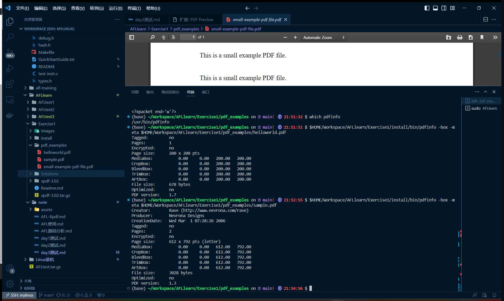
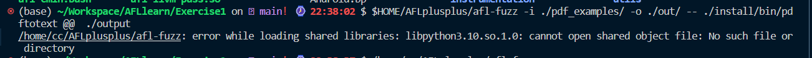
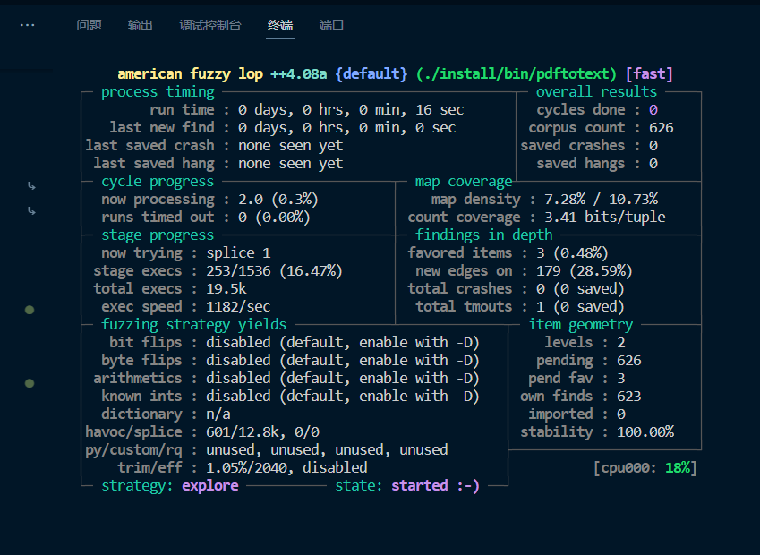

# Xpdf

## 准备

复现出CVE-2019-13288

### 下载材料

```bash
cd $HOME/Workspace/AFLlearn/Exercise1
wget https://dl.xpdfreader.com/old/xpdf-3.02.tar.gz
tar -xvzf xpdf-3.02.tar.gz
```

编译

```bash
cd xpdf-3.02
sudo apt update && sudo apt install -y build-essential gcc
./configure --prefix="$HOME/Workspace/AFLlearn/Exercise1/install/"
make
make install
```

测试编译是否成功，下载测试样例

```bash
cd $HOME/Workspace/AFLlearn/Exercise1
mkdir pdf_examples && cd pdf_examples
wget https://github.com/mozilla/pdf.js-sample-files/raw/master/helloworld.pdf
wget http://www.africau.edu/images/default/sample.pdf
wget https://www.melbpc.org.au/wp-content/uploads/2017/10/small-example-pdf-file.pdf
```

测试

```bash
$HOME/Workspace/AFLlearn/Exercise1/install/bin/pdfinfo -box -meta $HOME/Workspace/AFLlearn/Exercise1/pdf_examples/sample.pdf
```



#### 安装AFL++

```bash
sudo apt-get update
sudo apt-get install -y build-essential python3-dev automake git flex bison libglib2.0-dev libpixman-1-dev python3-setuptools
sudo apt-get install -y lld-11 llvm-11 llvm-11-dev clang-11 || sudo apt-get install -y lld llvm llvm-dev clang 
sudo apt-get install -y gcc-$(gcc --version|head -n1|sed 's/.* //'|sed 's/\..*//')-plugin-dev libstdc++-$(gcc --version|head -n1|sed 's/.* //'|sed 's/\..*//')-dev
```

编译

```bash
cd $HOME
git clone https://github.com/AFLplusplus/AFLplusplus && cd AFLplusplus
export LLVM_CONFIG="llvm-config-11"
make distrib
sudo make install
```

### 插桩

上面只是用于测试xfdp的使用，为了fuzz还是得用afl来编译才对

```bash
rm -rf install
cd $HOME/Workspace/AFLlearn/Exercise1/xpdf-3.02
make clean
CC=$HOME/AFLplusplus/afl-clang-fast CXX=$HOME/AFLplusplus/afl-clang-fast++ ./configure --prefix="$HOME/Workspace/AFLlearn/Exercise1/install/" 
make
make install
```

```bash
cd ~/Workspace/AFLlearn/Exercise1
mkdir out
afl-fuzz -i ./pdf_examples/ -o ./out/ -- ./install/bin/pdftotext @@  ./output
```

#### 报错



#### 解决

```bash
sudo find / -name libpython3.10.so.1.0
sudo cp /home/cc/anaconda3/lib/libpython3.10.so.1.0 /usr/lib
```


顺利运行

