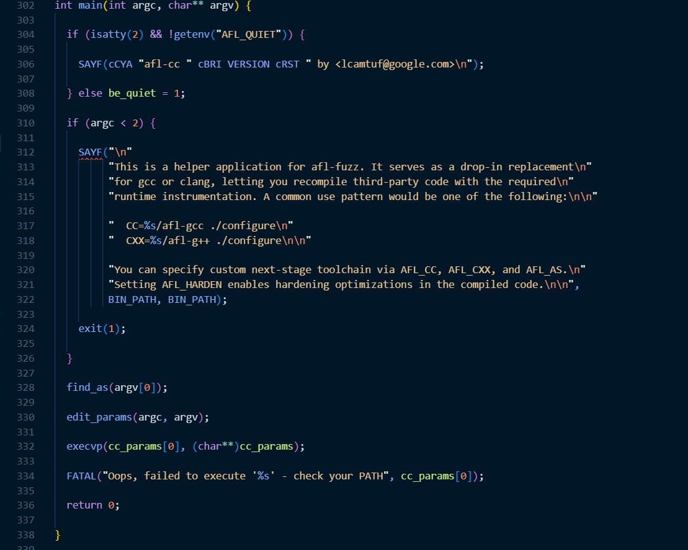
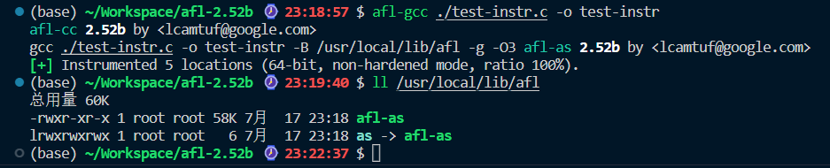
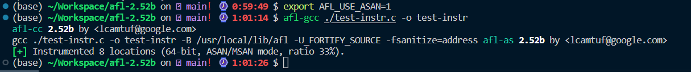
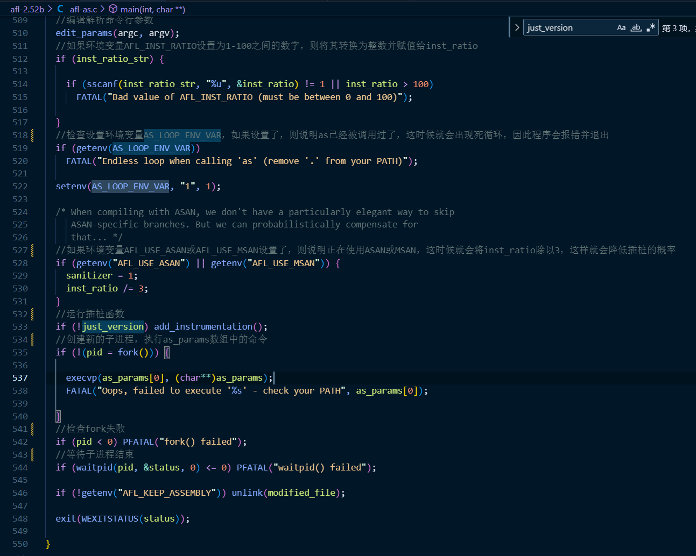

## AFL源码分析

### afl-as.c



`main`：

```c
find_as(argv[0]);                        //找到gcc/clang/llvm编译器
edit_params(argc, argv);                 //处理参数
execvp(cc_params[0], (char**)cc_params); //执行程序
```

其中`cc_params`在`edit_params`函数中进行赋值，在执行`execvp`前插入以下代码打印`cc_params`查看

```c
  for (int i = 0; i < sizeof(cc_params); ++i)
  {
    SAYF("%s ", *(cc_params + i));
  }
```

`sudo make` `sudo make install`编译afl

```bash
afl-gcc ./test-instr.c -o test-instr
```



可见`afl`实际上就是`gcc`，但是会自动加上`-B /usr/local/lib/afl -g -O3`的参数

```
-B  <目录>   将 <目录> 添加到编译器的搜索路径中
-g		生成调试信息
-O3  编译优化
```

此时编译器会根据`-B`后的参数目录中寻找汇编器

所以实际使用的汇编器就是`afl-as`

#### asan

asan为地址销杀器

`afl-gcc`中

```c
  if (asan_set) {
    //如果asan_set为非零值，设置环境变量AFL_USE_ASAN为1，告知afl-as开启ASAN
    /* Pass this on to afl-as to adjust map density. */

    setenv("AFL_USE_ASAN", "1", 1);

  } else if (getenv("AFL_USE_ASAN")) {
    //如果环境变量AFL_USE_ASAN存在，检查AFL_USE_MSAN，AFL_HARDEN是否开启，两者不能同时开启

    if (getenv("AFL_USE_MSAN"))
      FATAL("ASAN and MSAN are mutually exclusive");

    if (getenv("AFL_HARDEN"))
      FATAL("ASAN and AFL_HARDEN are mutually exclusive");
    //添加编译参数，关闭FORTIFY_SOURCE，开启ASAN
    cc_params[cc_par_cnt++] = "-U_FORTIFY_SOURCE";
    cc_params[cc_par_cnt++] = "-fsanitize=address";

  } else if (getenv("AFL_USE_MSAN")) {
    //同上，几种选项不能同时开
    if (getenv("AFL_USE_ASAN"))
      FATAL("ASAN and MSAN are mutually exclusive");

    if (getenv("AFL_HARDEN"))
      FATAL("MSAN and AFL_HARDEN are mutually exclusive");
    //添加编译参数，关闭FORTIFY_SOURCE，开启MSAN
    cc_params[cc_par_cnt++] = "-U_FORTIFY_SOURCE";
    cc_params[cc_par_cnt++] = "-fsanitize=memory";


  }
```

设置`export AFL_USE_ASAN=1`后再次afl-gcc编译，此时afl自动添加的参数变为`-B /usr/local/lib/afl -U_FORTIFY_SOURCE -fsanitize=address`



- `-U_FORTIFY_SOURCE`：这个编译选项用来禁用_FORTIFY_SOURCE，这是一种GCC的安全功能，用于在编译阶段检测一些常见的安全漏洞。
- `-fsanitize=address`：这个编译选项启用了AddressSanitizer，这是一种内存错误检测工具，可以检测一些常见的内存错误，如缓冲区溢出和使用后释放等问题。

接下来主要看用于差桩的`afl-as`

### afl-as

afl-as.c功能：预处理编译器生成的汇编，插入afl-as.h提供的二进制指令

过程：根据时间得到随机种子，编辑解析命令行参数，进入插桩函数，创建新的子进程，执行as_params数组中的命令。



#### add_instrumentation

查看函数`add_instrumentation`观察插桩。

```c
static void add_instrumentation(void) {

  static u8 line[MAX_LINE];

  FILE* inf;
  FILE* outf;
  s32 outfd;
  u32 ins_lines = 0;

  u8  instr_ok = 0, skip_csect = 0, skip_next_label = 0,
      skip_intel = 0, skip_app = 0, instrument_next = 0;
  if (input_file) {

    inf = fopen(input_file, "r");
    if (!inf) PFATAL("Unable to read '%s'", input_file);

  } else inf = stdin;

  outfd = open(modified_file, O_WRONLY | O_EXCL | O_CREAT, 0600);

  if (outfd < 0) PFATAL("Unable to write to '%s'", modified_file);

  outf = fdopen(outfd, "w");

  if (!outf) PFATAL("fdopen() failed");  

  while (fgets(line, MAX_LINE, inf)) {
    if (!pass_thru && !skip_intel && !skip_app && !skip_csect && instr_ok &&
        instrument_next && line[0] == '\t' && isalpha(line[1])) {

      fprintf(outf, use_64bit ? trampoline_fmt_64 : trampoline_fmt_32,
              R(MAP_SIZE));

      instrument_next = 0;
      ins_lines++;

    }
    fputs(line, outf);

    if (pass_thru) continue;
    if (line[0] == '\t' && line[1] == '.') {
      if (!clang_mode && instr_ok && !strncmp(line + 2, "p2align ", 8) &&
          isdigit(line[10]) && line[11] == '\n') skip_next_label = 1;

      if (!strncmp(line + 2, "text\n", 5) ||
          !strncmp(line + 2, "section\t.text", 13) ||
          !strncmp(line + 2, "section\t__TEXT,__text", 21) ||
          !strncmp(line + 2, "section __TEXT,__text", 21)) {
        instr_ok = 1;
        continue; 
      }

      if (!strncmp(line + 2, "section\t", 8) ||
          !strncmp(line + 2, "section ", 8) ||
          !strncmp(line + 2, "bss\n", 4) ||
          !strncmp(line + 2, "data\n", 5)) {
        instr_ok = 0;
        continue;
      }
      if (strstr(line, ".code")) {

        if (strstr(line, ".code32")) skip_csect = use_64bit;
        if (strstr(line, ".code64")) skip_csect = !use_64bit;

      }
    }
    if (strstr(line, ".intel_syntax")) skip_intel = 1;
    if (strstr(line, ".att_syntax")) skip_intel = 0;
    if (line[0] == '#' || line[1] == '#') {
      if (strstr(line, "#APP")) skip_app = 1;
      if (strstr(line, "#NO_APP")) skip_app = 0;
    }
    if (skip_intel || skip_app || skip_csect || !instr_ok ||
        line[0] == '#' || line[0] == ' ') continue;
    if (line[0] == '\t') {
      if (line[1] == 'j' && line[2] != 'm' && R(100) < inst_ratio) {
        fprintf(outf, use_64bit ? trampoline_fmt_64 : trampoline_fmt_32,
                R(MAP_SIZE));
        ins_lines++;
      }
      continue;
    }
    if (strstr(line, ":")) {

      if (line[0] == '.') {
        if ((isdigit(line[2]) || (clang_mode && !strncmp(line + 1, "LBB", 3)))
            && R(100) < inst_ratio) {
          if (!skip_next_label) instrument_next = 1; else skip_next_label = 0;
        }
      } else {
        instrument_next = 1;
    
      }

    }

  }
  if (ins_lines)
    fputs(use_64bit ? main_payload_64 : main_payload_32, outf);

  if (input_file) fclose(inf);
  fclose(outf);
  //当上边判断错误输出和终端关联，并且环境变量 AFL_QUIET 没有设置时，输出版本信息，否则进入这里
  //这段代码在不处于安静模式时，用于输出一些关于程序运行状态的信息，比如被插桩的位置数量、使用的位数、运行模式以及插桩比率。
  if (!be_quiet) {
    //如果 ins_lines（代表被插桩的位置数量）为 0，那么程序会打印一条警告信息，指出没有找到需要插桩的目标。如果 pass_thru 为 true，那么会在警告信息中添加一条注释，说明程序正在运行在 pass-thru 模式。
    if (!ins_lines) WARNF("No instrumentation targets found%s.",
                          pass_thru ? " (pass-thru mode)" : "");
    //如果 ins_lines 不为 0，那么程序会打印一条信息，指出已经插桩的位置数量、使用的位数（64 位或 32 位）、运行模式（加固模式，ASAN/MSAN 模式，或非加固模式）以及插桩比率。
    else OKF("Instrumented %u locations (%s-bit, %s mode, ratio %u%%).",
             ins_lines, use_64bit ? "64" : "32",
             getenv("AFL_HARDEN") ? "hardened" : 
             (sanitizer ? "ASAN/MSAN" : "non-hardened"),
             inst_ratio);
 
  }

}

```

实现插桩的位置k，插桩成功后ins_lines++，实际进行插桩的代码如下：对于64位的机器插入`trampoline_fmt_64`

```c
    if (!pass_thru && !skip_intel && !skip_app && !skip_csect && instr_ok &&
        instrument_next && line[0] == '\t' && isalpha(line[1])) {

      fprintf(outf, use_64bit ? trampoline_fmt_64 : trampoline_fmt_32,
              R(MAP_SIZE));

      instrument_next = 0;
      ins_lines++;

    }
```

`trampoline_fmt_64`的定义在`afl-as.h`中

```c
static const u8* trampoline_fmt_64 =

  "\n"
  "/* --- AFL TRAMPOLINE (64-BIT) --- */\n"
  "\n"
  ".align 4\n"
  "\n"
  "leaq -(128+24)(%%rsp), %%rsp\n"
  "movq %%rdx,  0(%%rsp)\n"
  "movq %%rcx,  8(%%rsp)\n"
  "movq %%rax, 16(%%rsp)\n"
  "movq $0x%08x, %%rcx\n"
  "call __afl_maybe_log\n"
  "movq 16(%%rsp), %%rax\n"
  "movq  8(%%rsp), %%rcx\n"
  "movq  0(%%rsp), %%rdx\n"
  "leaq (128+24)(%%rsp), %%rsp\n"
  "\n"
  "/* --- END --- */\n"
  "\n";
```

64位跳板序列，调用函数__afl_maybe_log，记录执行路径。保存程序状态，调用函数__afl_maybe_log完成后，恢复程序状态。

具体分析：

- ".align 4"：这一行让代码段按照4字节对齐。
- "leaq -(128+24)(%%rsp), %%rsp"：这一行将栈指针向下移动152字节，为保存寄存器和其他数据腾出空间。
- 接下来的三行 "movq %%rdx, 0(%%rsp)", "movq %%rcx, 8(%%rsp)" 和 "movq %%rax, 16(%%rsp)" 将RDX，RCX，RAX寄存器的值分别保存到栈上的相应位置。
- "movq $0x%08x, %%rcx"：这行将一个格式化的8位数值（作为插桩ID）加载到RCX寄存器。
- "call __afl_maybe_log"：调用__afl_maybe_log函数，该函数用于记录当前执行的插桩ID。
- 接下来的三行代码 "movq 16(%%rsp), %%rax", "movq 8(%%rsp), %%rcx" 和 "movq 0(%%rsp), %%rdx" 将原来保存在栈上的RAX，RCX，RDX寄存器的值取出，恢复这些寄存器的原始值。
- "leaq (128+24)(%%rsp), %%rsp"：这行将栈指针向上移动152字节，即恢复原来的栈指针。

在不改变原程序状态（包括寄存器和栈的状态）的情况下，记录执行路径，以便在后续进行程序分析。

`__afl_maybe_log`函数的定义在`main_payload_64`中实现

`main_payload_64`中定义的函数如下：

- `__afl_maybe_log`：测试是否已映射共享内存区域。如果有，它会记录覆盖范围，否则，它会尝试设置它。
- `__afl_store`：计算并存储特定代码位置的命中，标记它已被执行。
- `__afl_return`：恢复标志并将控制权返回给被测程序。
- `__afl_setup`：设置用于记录覆盖范围的共享内存区域。它处理初始设置和错误情况，然后跳回到`__afl_store`或`__afl_return`
- `__afl_setup_first`：此函数保存可能受共享库调用影响的所有寄存器并设置共享内存。如果出现问题，它将转到 `__afl_setup_abort`。
- `__afl_forkserver`：设置分叉服务器模式以减少调用开销。使用创建进程的克隆，并处理与父进程的通信。`execve()``fork()`
- `__afl_fork_resume`：此函数适用于子进程、关闭文件描述符和恢复执行。

