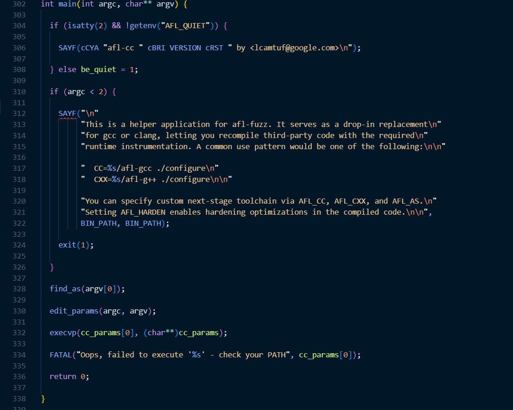
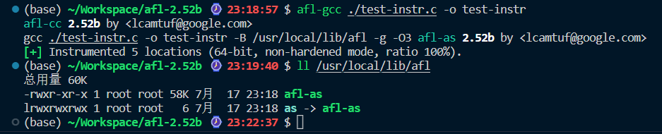
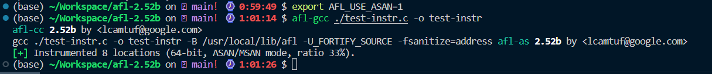

## AFL源码分析

### afl-as.c



`main`：

```c
find_as(argv[0]);                        //找到gcc/clang/llvm编译器
edit_params(argc, argv);                 //处理参数
execvp(cc_params[0], (char**)cc_params); //执行程序
```

其中`cc_params`在`edit_params`函数中进行赋值，在执行`execvp`前插入以下代码打印`cc_params`查看

```c
  for (int i = 0; i < sizeof(cc_params); ++i)
  {
    SAYF("%s ", *(cc_params + i));
  }
```

`sudo make` `sudo make install`编译afl

```bash
afl-gcc ./test-instr.c -o test-instr
```



可见`afl`实际上就是`gcc`，但是会自动加上`-B /usr/local/lib/afl -g -O3`的参数

```
-B  <目录>   将 <目录> 添加到编译器的搜索路径中
-g		生成调试信息
-O3  编译优化
```

此时编译器会根据`-B`后的参数目录中寻找汇编器

所以实际使用的汇编器就是`afl-as`

#### asan

asan为地址销杀器

`afl-gcc`中

```c
  if (asan_set) {
    //如果asan_set为非零值，设置环境变量AFL_USE_ASAN为1，告知afl-as开启ASAN
    /* Pass this on to afl-as to adjust map density. */

    setenv("AFL_USE_ASAN", "1", 1);

  } else if (getenv("AFL_USE_ASAN")) {
    //如果环境变量AFL_USE_ASAN存在，检查AFL_USE_MSAN，AFL_HARDEN是否开启，两者不能同时开启

    if (getenv("AFL_USE_MSAN"))
      FATAL("ASAN and MSAN are mutually exclusive");

    if (getenv("AFL_HARDEN"))
      FATAL("ASAN and AFL_HARDEN are mutually exclusive");
    //添加编译参数，关闭FORTIFY_SOURCE，开启ASAN
    cc_params[cc_par_cnt++] = "-U_FORTIFY_SOURCE";
    cc_params[cc_par_cnt++] = "-fsanitize=address";

  } else if (getenv("AFL_USE_MSAN")) {
    //同上，几种选项不能同时开
    if (getenv("AFL_USE_ASAN"))
      FATAL("ASAN and MSAN are mutually exclusive");

    if (getenv("AFL_HARDEN"))
      FATAL("MSAN and AFL_HARDEN are mutually exclusive");
    //添加编译参数，关闭FORTIFY_SOURCE，开启MSAN
    cc_params[cc_par_cnt++] = "-U_FORTIFY_SOURCE";
    cc_params[cc_par_cnt++] = "-fsanitize=memory";


  }
```

设置`export AFL_USE_ASAN=1`后再次afl-gcc编译，此时afl自动添加的参数变为`-B /usr/local/lib/afl -U_FORTIFY_SOURCE -fsanitize=address`


