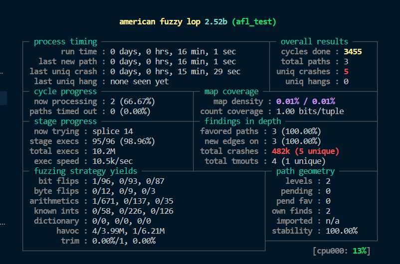
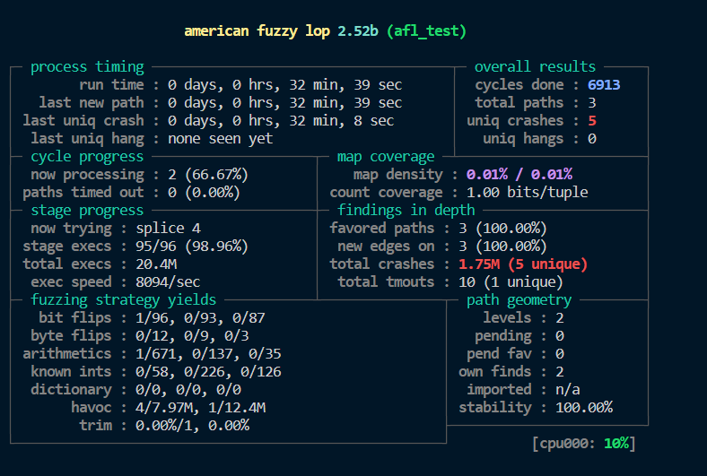
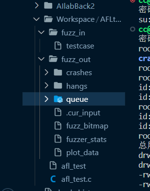
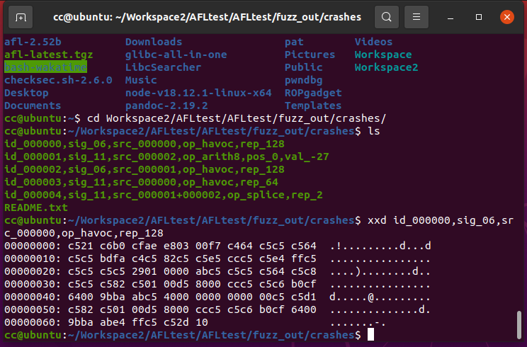
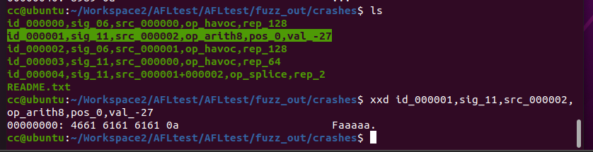
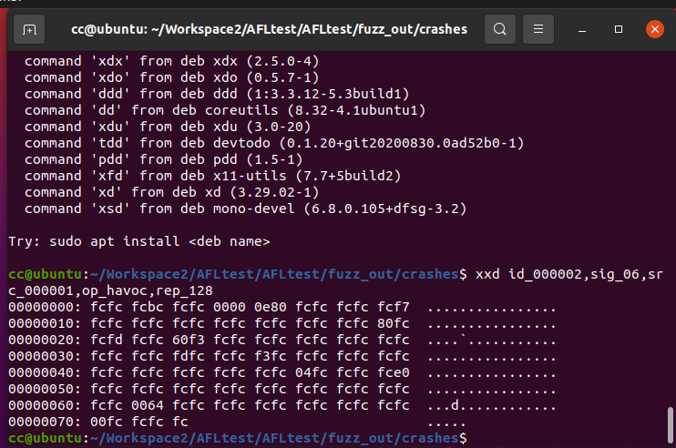
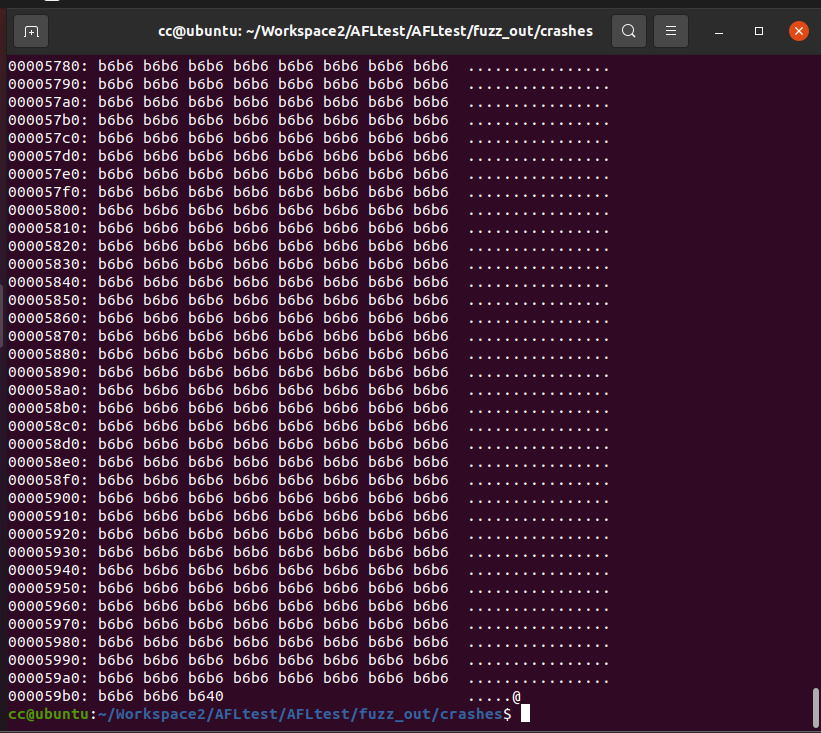
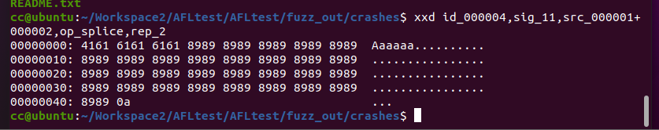

# Day1

关键词：`afl-fuzz等环境安装`

一开始在虚拟机里测试，发现运行速度感人，先花了几小时把旧电脑重装成了ubuntu


参考博客https://blog.csdn.net/qq_42896005/article/details/108886195
和https://xz.aliyun.com/t/4314

官网http://lcamtuf.coredump.cx/afl/下载afl

进入linux，解压

```bash
tar -zxf ./afl-latest.tgz
cd afl-2.52b/
```

编译

```bash
make
sudo make install
```

输入afl-fuzz测试安装是否成功

创建工作目录，工作目录中创建fuzz_in,fuzz_out两个文件夹,fuzz_in文件夹下创建testcase文件作为初始传入的参数

```bash
mkdir fuzz_in
mkdir fuzz_out
echo aaa > fuzz_in/testcase
```

创建文件afl_test.c进行测试

```c
#include <stdio.h> 
#include <stdlib.h> 
#include <unistd.h> 
#include <string.h> 
#include <signal.h> 

int vuln(char *str)
{
    int len = strlen(str);
    if(str[0] == 'A' && len == 66)
    {
        raise(SIGSEGV);
        //如果输入的字符串的首字符为A并且长度为66，则异常退出
    }
    else if(str[0] == 'F' && len == 6)
    {
        raise(SIGSEGV);
        //如果输入的字符串的首字符为F并且长度为6，则异常退出
    }
    else
    {
        printf("it is good!\n");
    }
    return 0;
}

int main(int argc, char *argv[])
{
    char buf[100]={0};
    gets(buf);//存在栈溢出漏洞
    printf(buf);//存在格式化字符串漏洞
    vuln(buf);

    return 0;
}
```

编译

```bash
afl-gcc -g -o afl_test afl_test.c
```

## 开始FUZZ

对于可以直接从stdin中读入输入的目标

```bash
afl-fuzz -i testcase_dir -o findings_dir /path/to/program […params…]
```

对于从文件读取输入的目标程序

```bash
afl-fuzz -i testcase_dir -o findings_dir /path/to/program @@
```


对于该案例

```bash
afl-fuzz -i fuzz_in -o fuzz_out ./afl_test
```


出现报错

```bash
[-] Hmm, your system is configured to send core dump notifications to an
    external utility. This will cause issues: there will be an extended delay
    between stumbling upon a crash and having this information relayed to the
    fuzzer via the standard waitpid() API.

    To avoid having crashes misinterpreted as timeouts, please log in as root
    and temporarily modify /proc/sys/kernel/core_pattern, like so:

    echo core >/proc/sys/kernel/core_pattern

[-] PROGRAM ABORT : Pipe at the beginning of 'core_pattern'
         Location : check_crash_handling(), afl-fuzz.c:7275
```

解决方法：

```bash
sudo su
 
echo core >/proc/sys/kernel/core_patter
```


再次运行，又出现报错

```
[-] Whoops, your system uses on-demand CPU frequency scaling, adjusted
    between 1171 and 3125 MHz. Unfortunately, the scaling algorithm in the
    kernel is imperfect and can miss the short-lived processes spawned by
    afl-fuzz. To keep things moving, run these commands as root:

    cd /sys/devices/system/cpu
    echo performance | tee cpu*/cpufreq/scaling_governor

    You can later go back to the original state by replacing 'performance' with
    'ondemand'. If you don't want to change the settings, set AFL_SKIP_CPUFREQ
    to make afl-fuzz skip this check - but expect some performance drop.

[-] PROGRAM ABORT : Suboptimal CPU scaling governor
         Location : check_cpu_governor(), afl-fuzz.c:7337
```

解决方法

```bash
export AFL_SKIP_CPUFREQ=1
```

再次运行运行fuzz

原先虚拟机执行速度只能100/sec，现在可以达到10k/sec



## 分析crash

运行30分钟后，crash数始终为5（其实刚运行时就已经是5了）



进入fuzz_out查看crash



其中crashes文件存放产生crash的样例，hangs产生超时样例，queue里产生不同执行路径的测试用例

查看第一个样例



查看第二个样例，首字母是F，长度为6，符合



查看第三个样例



查看第四个样例，特别特别长，符合栈溢出



查看第五个样例，首字母为A且长度等于66



