# Day2

**关键词**：`afl-qemu-trace环境安装`

**运行环境**：`afl_2.52` 、`gcc 9.4.0` 、`ubuntu 20.04.5`

昨天环境配了好久，重装了好几次

今天测试fuzz readelf，对于无源码AFL测试需要用qemu进行测试，参数为-Q

首先得到elf文件，将上次的c程序用gcc编译得到可执行文件（按理这个应该就是elf文件了，但是感觉这么大的东西应该fuzz不动，还是把elf头提取出来吧）

```bash
gcc ./afl_test.c -o ./afl_test
objcopy --only-keep-debug ./afl_test ./afl_test_new # 提取elf头
# 将afl_test_new放到afl_in文件夹，重命名为testcase
sudo cp /usr/bin/readelf .
```

开始fuzz

```bash
afl-fuzz -i fuzz_in -o fuzz_out -Q ./readelf -a @@
```

报错

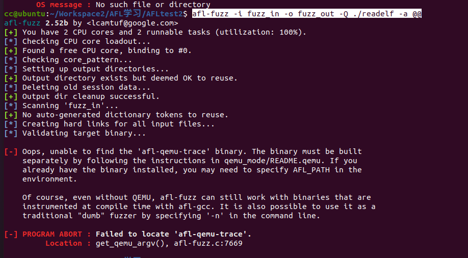

```
[-] Oops, unable to find the 'afl-qemu-trace' binary. The binary must be built
    separately by following the instructions in qemu_mode/README.qemu. If you
    already have the binary installed, you may need to specify AFL_PATH in the
    environment.

    Of course, even without QEMU, afl-fuzz can still work with binaries that are
    instrumented at compile time with afl-gcc. It is also possible to use it as a
    traditional "dumb" fuzzer by specifying '-n' in the command line.

[-] PROGRAM ABORT : Failed to locate 'afl-qemu-trace'.
         Location : get_qemu_argv(), afl-fuzz.c:7669
```

原因是qemu模式还没有安装

转移到afl根目录下的qemu_mode目录，安装

```bash
cd ~/afl-2.52b/qemu_mode
sudo ./build_qemu_support.sh
cd ..
make install
```

**会产生报错，简要来说基本就是报哪个错就apt install那哪个，总结下来有libtool  libtool-bin bison，并且把脚本中需要python2，sudo ln -s /bin/python2 /bin/python**

报错

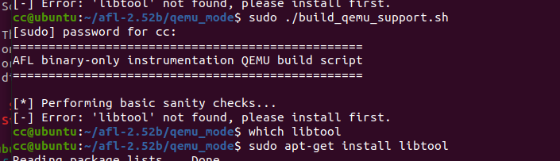


```
[*] Performing basic sanity checks...
[-] Error: 'libtool' not found, please install first.
```

需要注意的是libtool报错时需要安装libtool和libtool-bin

```bash
sudo apt-get install libtool
sudo apt-get install libtool-bin
```


此时报错404，一访问发现确实

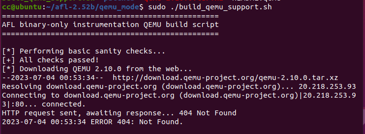

解决方法把脚本里的`download.qemu-project.org/qemu-`改成`download.qemu.org/qemu-`

漫长的安装后终于。。又报错了，接下来是重点

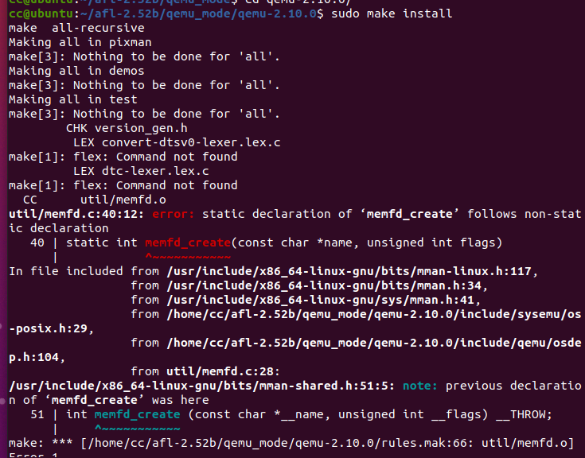

### 解决方案

根据报错信息，问题是当前qemu-2.10.0/util/memfd.c文件的45行出现声明冲突

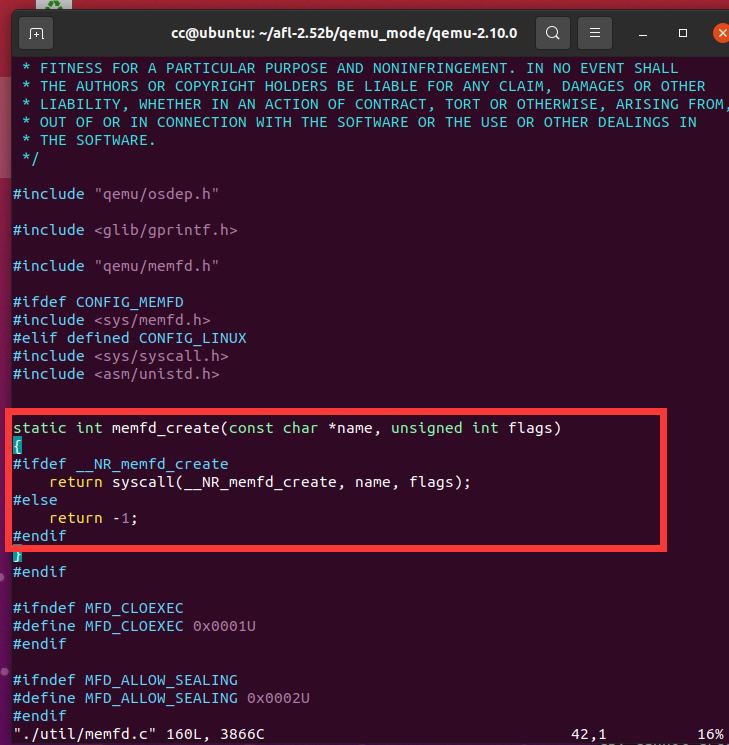


可能是这个函数在别的程序中文件中被命名了，但实在找不到，试了几种办法都没成功，之后我（先备份下）将这个文件中所有出现memfd_create的地方改成my_memfd_create，确实进入了一段很长时间的make install，但还是报错了

（后来发现实际是memfd_create和glibc中的同名函数冲突了，所以需要给安装包打patche，上面的方案并没有用，之后会有其他更多冲突）

**解决方案如下**

修改了几个报错的文件，让他能运行（并不保证其功能完全正确，只能保让让他能跑起来，影响有多大就不知道了）

在`qemu_mode/patches`文件夹下，有一些diff文件，应该是afl对原本的qemu进行了魔改，打开`build_qemu_support.sh`文件，看见其中有这样的内容：

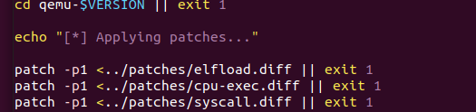

而diff文件中的内容大概是这样的

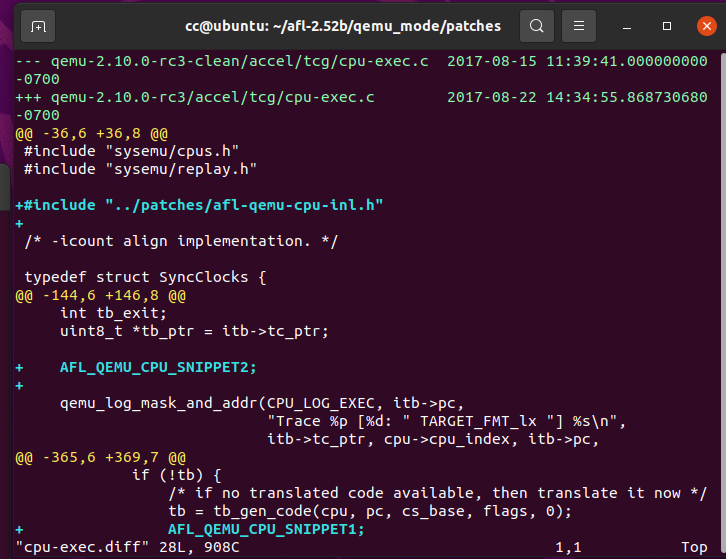

猜测是创作者先将文件拷贝到clean文件夹后对其进行了补丁，然后用

`diff -ru cleanfile patchfile`得到这些diff文件，之后通过patch命令对这些文件进行每次运行脚本时的自动修改

仿照其原理，通过一次次报错信息在`qemu_mode/patches`文件夹下创建diff文件`memfd_create.diff`

`memfd_create.diff`

```diff
diff -ru qemu-2.10.0-clean/util/memfd.c qemu-2.10.0/util/memfd.c
--- qemu-2.10.0-clean/util/memfd.c      2018-11-20 18:11:00.170271506 +0100
+++ qemu-2.10.0/util/memfd.c    2018-11-20 18:11:13.398423613 +0100
@@ -37,7 +37,7 @@
 #include <sys/syscall.h>
 #include <asm/unistd.h>

-static int memfd_create(const char *name, unsigned int flags)
+int memfd_create(const char *name, unsigned int flags)
 {
 #ifdef __NR_memfd_create
     return syscall(__NR_memfd_create, name, flags);
```

修改原理：


memfd_create和glibc中的同名函数冲突了

之后又发现出现新报错

```
/home/cc/afl-2.52b/qemu_mode/qemu-2.10.0/linux-user/syscall.c:261:16: error: static declaration of ‘gettid’ follows non-static declaration
  261 | _syscall0(int, gettid)
      |                ^~~~~~
/home/cc/afl-2.52b/qemu_mode/qemu-2.10.0/linux-user/syscall.c:191:13: note: in definition of macro ‘_syscall0’
  191 | static type name (void)   \
      |             ^~~~
In file included from /usr/include/unistd.h:1218,
                 from /home/cc/afl-2.52b/qemu_mode/qemu-2.10.0/include/qemu/osdep.h:75,
                 from /home/cc/afl-2.52b/qemu_mode/qemu-2.10.0/linux-user/syscall.c:20:
/usr/include/x86_64-linux-gnu/bits/unistd_ext.h:34:16: note: previous declaration of ‘gettid’ was here
   34 | extern __pid_t gettid (void) __THROW;
      |                ^~~~~~
/home/cc/afl-2.52b/qemu_mode/qemu-2.10.0/linux-user/ioctls.h:173:9: error: ‘SIOCGSTAMP’ undeclared here (not in a function); did you mean ‘SIOCSRARP’?
  173 |   IOCTL(SIOCGSTAMP, IOC_R, MK_PTR(MK_STRUCT(STRUCT_timeval)))
      |         ^~~~~~~~~~
/home/cc/afl-2.52b/qemu_mode/qemu-2.10.0/linux-user/syscall.c:5597:23: note: in definition of macro ‘IOCTL’
 5597 |     { TARGET_ ## cmd, cmd, #cmd, access, 0, {  __VA_ARGS__ } },
      |                       ^~~
/home/cc/afl-2.52b/qemu_mode/qemu-2.10.0/linux-user/ioctls.h:174:9: error: ‘SIOCGSTAMPNS’ undeclared here (not in a function); did you mean ‘SIOCGSTAMP_OLD’?
  174 |   IOCTL(SIOCGSTAMPNS, IOC_R, MK_PTR(MK_STRUCT(STRUCT_timespec)))

```

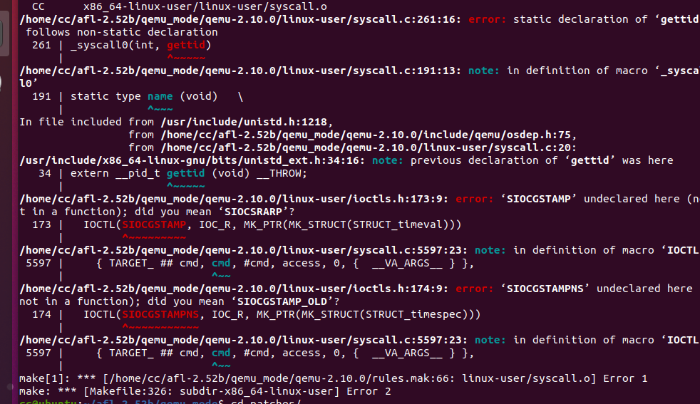

自己打补丁打了好久最后也没打出来，然后发现这篇博客说github有补丁https://blog.csdn.net/geniusle201/article/details/111028697

https://github.com/google/AFL/issues/41

于是只需要修改syscall.diff文件为以下内容即可

```diff
--- qemu-2.10.0-clean/linux-user/syscall.c	2020-03-12 18:47:47.898592169 +0100
+++ qemu-2.10.0/linux-user/syscall.c	2020-03-12 19:16:41.563074307 +0100
@@ -34,6 +34,7 @@
 #include <sys/resource.h>
 #include <sys/swap.h>
 #include <linux/capability.h>
+#include <linux/sockios.h> // https://lkml.org/lkml/2019/6/3/988
 #include <sched.h>
 #include <sys/timex.h>
 #ifdef __ia64__
@@ -116,6 +117,8 @@ int __clone2(int (*fn)(void *), void *ch
 #include "qemu.h"

+extern unsigned int afl_forksrv_pid;
+
 #ifndef CLONE_IO
 #define CLONE_IO                0x80000000      /* Clone io context */
 #endif
 
@@ -256,7 +259,9 @@ static type name (type1 arg1,type2 arg2,
 #endif

 #ifdef __NR_gettid
-_syscall0(int, gettid)
+// taken from https://patchwork.kernel.org/patch/10862231/
+#define __NR_sys_gettid __NR_gettid
+_syscall0(int, sys_gettid)
 #else
 /* This is a replacement for the host gettid() and must return a host
    errno. */
@@ -6219,7 +6224,8 @@ static void *clone_func(void *arg)
     cpu = ENV_GET_CPU(env);
     thread_cpu = cpu;
     ts = (TaskState *)cpu->opaque;
-    info->tid = gettid();
+    // taken from https://patchwork.kernel.org/patch/10862231/
+    info->tid = sys_gettid();
     task_settid(ts);
     if (info->child_tidptr)
         put_user_u32(info->tid, info->child_tidptr);
@@ -6363,9 +6369,11 @@ static int do_fork(CPUArchState *env, un
                mapping.  We can't repeat the spinlock hack used above because
                the child process gets its own copy of the lock.  */
             if (flags & CLONE_CHILD_SETTID)
-                put_user_u32(gettid(), child_tidptr);
+                // taken from https://patchwork.kernel.org/patch/10862231/
+                put_user_u32(sys_gettid(), child_tidptr);
             if (flags & CLONE_PARENT_SETTID)
-                put_user_u32(gettid(), parent_tidptr);
+                // taken from https://patchwork.kernel.org/patch/10862231/
+                put_user_u32(sys_gettid(), parent_tidptr);
             ts = (TaskState *)cpu->opaque;
             if (flags & CLONE_SETTLS)
                 cpu_set_tls (env, newtls);
@@ -11402,7 +11410,8 @@ abi_long do_syscall(void *cpu_env, int n
         break;
 #endif
     case TARGET_NR_gettid:
-        ret = get_errno(gettid());
+        // taken from https://patchwork.kernel.org/patch/10862231/
+        ret = get_errno(sys_gettid());
         break;
 #ifdef TARGET_NR_readahead
     case TARGET_NR_readahead:

```

终于成功了

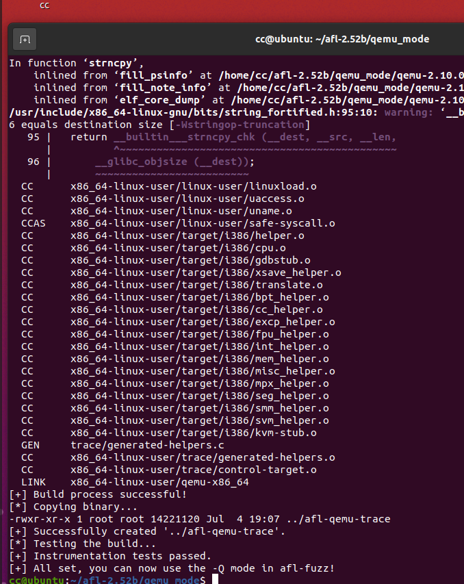

回到afl根目录，出现afl-qemu-trace，拷贝到/usr/local/bin

```bash
sudo cp afl-qemu-trace /usr/local/bin/afl-qemu-trace
```

终于可以开始

```bash
afl-fuzz -i fuzz_in -o fuzz_out -Q ./readelf -a @@
```

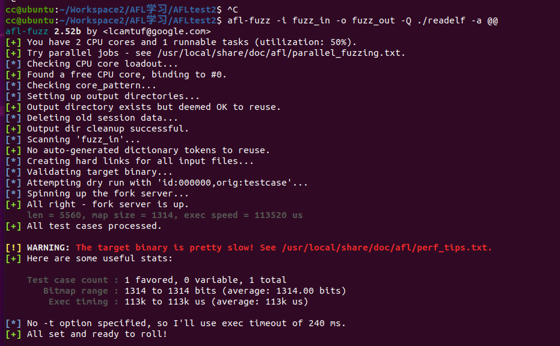

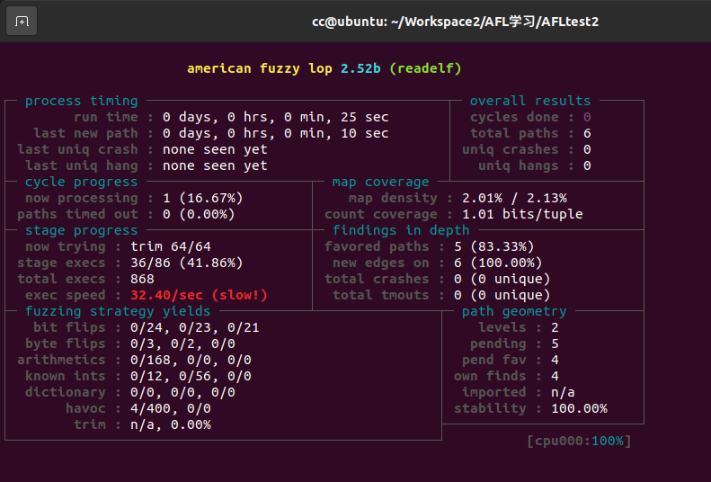