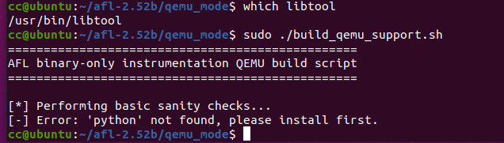
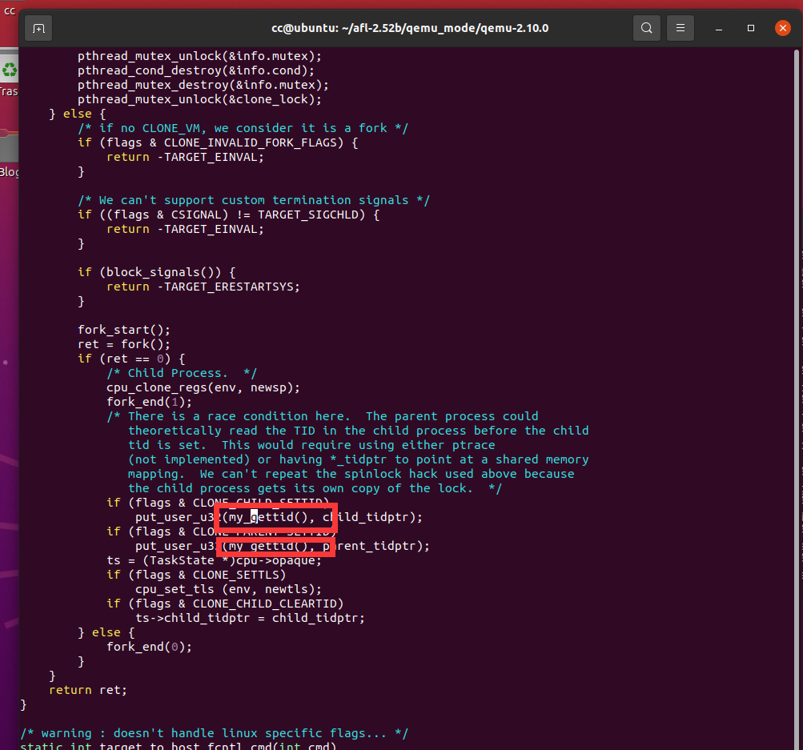
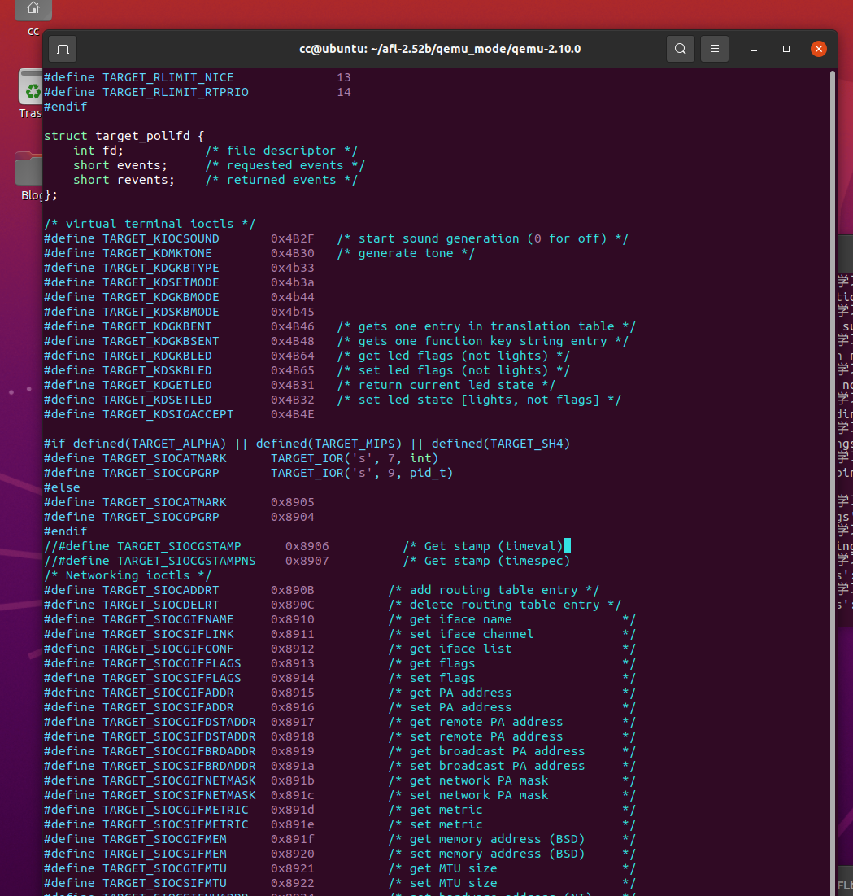
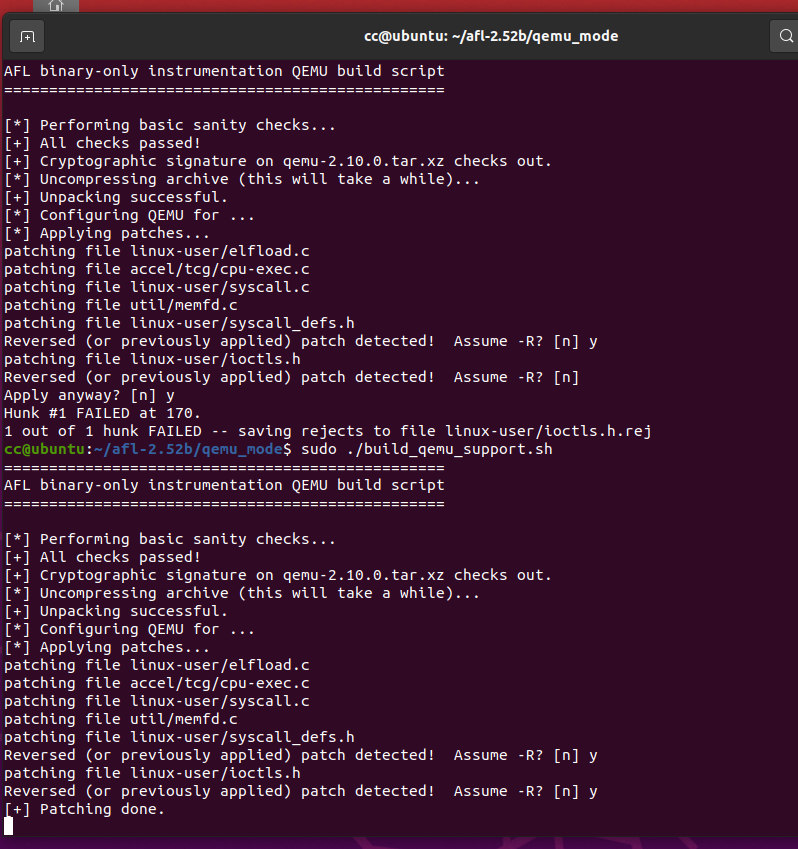

# Day2

关键词：`afl-qemu-trace环境安装`

昨天环境配了好久，重装了好几次

今天测试fuzz readelf，对于无源码AFL测试需要用qemu进行测试，参数为-Q

首先得到elf文件，将上次的c程序用gcc编译得到可执行文件（按理这个应该就是elf文件了，但是感觉这么大的东西应该fuzz不动，还是把elf头提取出来吧）

```bash
gcc ./afl_test.c -o ./afl_test
objcopy --only-keep-debug ./afl_test ./afl_test_new # 提取elf头
# 将afl_test_new放到afl_in文件夹，重命名为testcase
sudo cp /usr/bin/readelf .
```

开始fuzz

```bash
afl-fuzz -i fuzz_in -o fuzz_out -Q ./readelf -a @@
```

报错


```
[-] Oops, unable to find the 'afl-qemu-trace' binary. The binary must be built
    separately by following the instructions in qemu_mode/README.qemu. If you
    already have the binary installed, you may need to specify AFL_PATH in the
    environment.

    Of course, even without QEMU, afl-fuzz can still work with binaries that are
    instrumented at compile time with afl-gcc. It is also possible to use it as a
    traditional "dumb" fuzzer by specifying '-n' in the command line.

[-] PROGRAM ABORT : Failed to locate 'afl-qemu-trace'.
         Location : get_qemu_argv(), afl-fuzz.c:7669
```

原因是qemu模式还没有安装

转移到afl根目录下的qemu_mode目录，安装

```bash
cd ~/afl-2.52b/qemu_mode
sudo ./build_qemu_support.sh
cd ..
make install
```

**以下内容没有特别多看的必要，基本就是报哪个错就apt install那哪个，总结下来有libtool  libtool-bin bison，并且把脚本中的python改成python2就行了(临时改下，完成后记得恢复)**sudo ln -s /bin/python2 /bin/python

报错


```
[*] Performing basic sanity checks...
[-] Error: 'libtool' not found, please install first.
```

输入

```bash
sudo apt-get install libtool
```

发现仍然报错，且which libtool也没有显示

```bash
sudo apt-get install libtool-bin
```



发现python找不到，直接sudo ln -s /bin/python2 /bin/python


此时报错404，一访问发现确实


解决方法把脚本里的`download.qemu-project.org/qemu-`改成`download.qemu.org/qemu-`

漫长的安装后终于完成

sudo ./build_qemu_support.sh


```bash
cd qemu-2.10.0
sudo make install 
```

报错


### 解决方案

根据报错信息，问题是当前qemu-2.10.0/util/memfd.c文件的45行出现声明冲突


可能是这个函数在别的程序中文件中被命名了，但实在找不到，试了几种办法都没成功，之后我（先备份下）将这个文件中所有出现memfd_create的地方改成my_memfd_create，确实进入了一段很长时间的make install，但还是报错了

（后来发现实际是memfd_create和glibc中的同名函数冲突了，所以需要给安装包打patche，上面的方案并没有用，之后会有其他更多冲突）

**解决方案如下**

修改以下文件：






