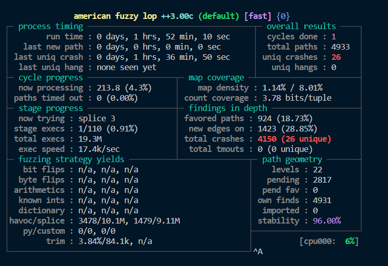

# day3

## libxml2

寻找`CVE-2015-8317`

题目链接https://github.com/mykter/afl-training/tree/main/challenges/libxml2

先了解下libxml2的基本使用


#### ASAN

参考文章https://zhuanlan.zhihu.com/p/51443698，http://blog.binpang.me/2018/07/31/afl-asan/

> AddressSanitizer，高效的内存错误检测工具，原先是LLVM的特性，后被加入GCC4.9，使用方法是在AFL编译软件前设置环境变量AFL_USE_ASAN=1 
>
> ```bash
> export AFL_USE_ASAN=1
> ```
>
> **为什么要开启ASAN**
>
> 1. 很多内存操作的错误不会导致程序崩溃，例如越界，不开启ASAN很多内存错误无法被AFL发现
>
> **注意事项**
>
> 由于ASAN工具会跟踪所有内存，所以需要的内存很大，分析32位程序中最多占用800MB内存；而分析64位程序时会占用20TB，因此需要作出相应更改：
>
> 实际上，以上最大内存只是理论上的，一般运行的程序shadow memory所占用的内存并没有这么多，所以第一种解决方法就是使用-m none选项，来忽略此错误:
>
> ```
> afl-fuzz -i in -o out -m none ./executable
> ```
>
> 第二种方法就是使用cgroup来限定改程序使用的资源：
>
> ```
> sudo ~/afl/experimental/asan_cgroups/limit_memory.sh -u usename afl-fuzz -i in -o out -m none ./executable
> ```
>
> 第二种方法是比较稳妥的方法，并不会对系统造成非常大的影响，因为其限定了程序所使用的内存资源。

### 开始复现

发现可以通过docker进项服务的安装

```bash
cd environment
sudo docker build . -t fuzz-training
sudo docker run --privileged  -ti --name=my-afl-train -e  PASSMETHOD=env -e PASS=password  fuzz-training 
 /bin/bash
```

<span style="text-decoration: line-through">进去后发现该有的afl环境该有的都有，可恶，当时一个个工具白编译安装了。</span>

#### 翻译README

libxml2是一个热门的XML库。很适合用来fuzzing，理由如下：

1. 经常解析用户提供的数据
2. 使用不安全的语言编写
3. 无状态
4. 不和网络宇文件交互
5. 官方提供的API是很好的目标 - 不需要识别和鼓励内部组件来fuzz
6. 快

这使得他成为模糊测试挂载点的首选目标

我们将尝试寻找CVE-2015-8317

通过运行以下命令构建并测试带有AFL和 Address Sanitizer instrumentation

```bash
    git submodule init && git submodule update # 这一步在docker创建过程中已经完成了，如果在非docker中需要做
    cd libxml2
    CC=afl-clang-fast ./autogen.sh # 你也可以使用afl-clang-lto，他通常是更好的选择，但奇怪的是在这个案例中需要更长时间开寻找bug
    AFL_USE_ASAN=1 make -j 4
    # ./testModule # 如果您使用ASAN进行编译，运行命令"./testModule"时测试会失败-内置的测试挂载点存在非法内存访问！
    # 在非特权容器中无法进行泄漏检测，因为无法附加到进程上。如果要禁用ASAN的泄漏检测功能，请设置ASAN_OPTIONS=detect_leaks=0，例如：ASAN_OPTIONS=detect_leaks=0 ./testModule
```

现在我们有了一个可工作的仪器化的库构建版本，但是没有可用的模糊测试挂载点。

请查阅文档-其中的[示例](http://xmlsoft.org/examples/index.html)可能是最容易理解的-并考虑创建模糊测试挂载点的良好方法。

如果您对尝试实验或对自己的方法有信心，请实现一个挂载点并查看是否可以发现任何错误！或者，直接转到[HINTS.md](https://chat.openai.com/HINTS.md)获取一些有关创建良好的libxml2模糊测试挂载点的具体指导。

实现挂载点后，您可以使用以下类似的命令进行编译：

```bash
AFL_USE_ASAN=1 afl-clang-fast ./harness.c -I libxml2/include libxml2/.libs/libxml2.a -lz -lm -o fuzzer
```

#### 挂载

创建文件harness.c

```c
#include "libxml/parser.h"
#include "libxml/tree.h"
#include <unistd.h>

__AFL_FUZZ_INIT();

int main(int argc, char **argv) {
    #ifdef __AFL_HAVE_MANUAL_CONTROL
        __AFL_INIT();
    #endif
    unsigned char *buf = __AFL_FUZZ_TESTCASE_BUF;  // must be after __AFL_INIT

    xmlInitParser();
    while (__AFL_LOOP(1000)) {
        int len = __AFL_FUZZ_TESTCASE_LEN;
        xmlDocPtr doc = xmlReadMemory((char *)buf, len, "https://mykter.com", NULL, 0);
        if (doc != NULL) {
            xmlFreeDoc(doc);
        }
    }
    xmlCleanupParser();

    return(0);
}
```

编译harnless

```bash
AFL_USE_ASAN=1 afl-clang-fast ./harness.c -I libxml2/include libxml2/.libs/libxml2.a -lz -lm -o fuzzer
```

创建初始seed

```bash
mkdir in
echo "<hi></hi>" > in/hi.xml
```

开始fuzz，-x是fuzzer的字典，使用@@是因为harness是用argv作为输入。


```bash
afl-fuzz -i in -o out -x /home/fuzzer/AFLplusplus/dictionaries/xml.dict ./fuzzer @@
```


