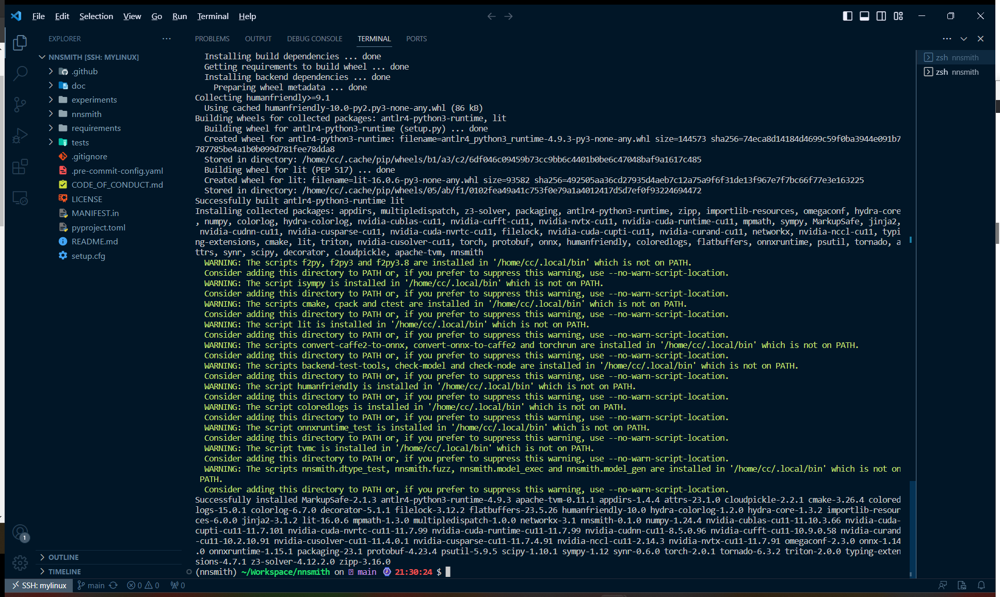
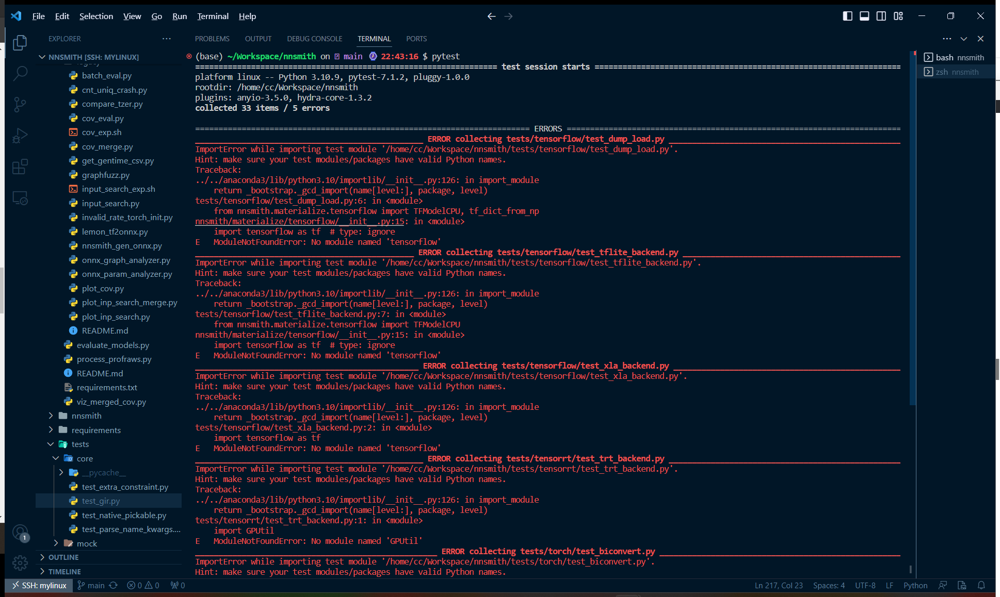
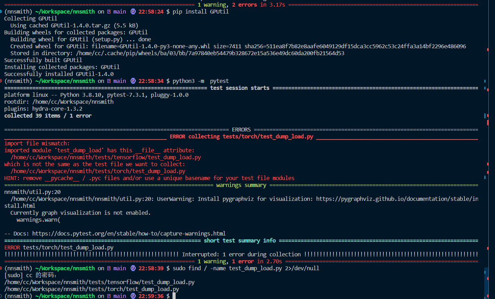
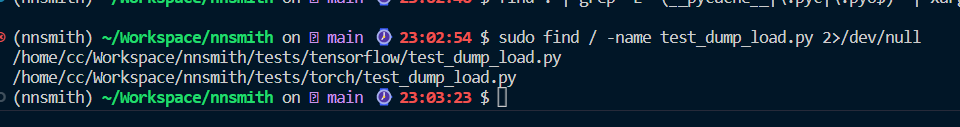
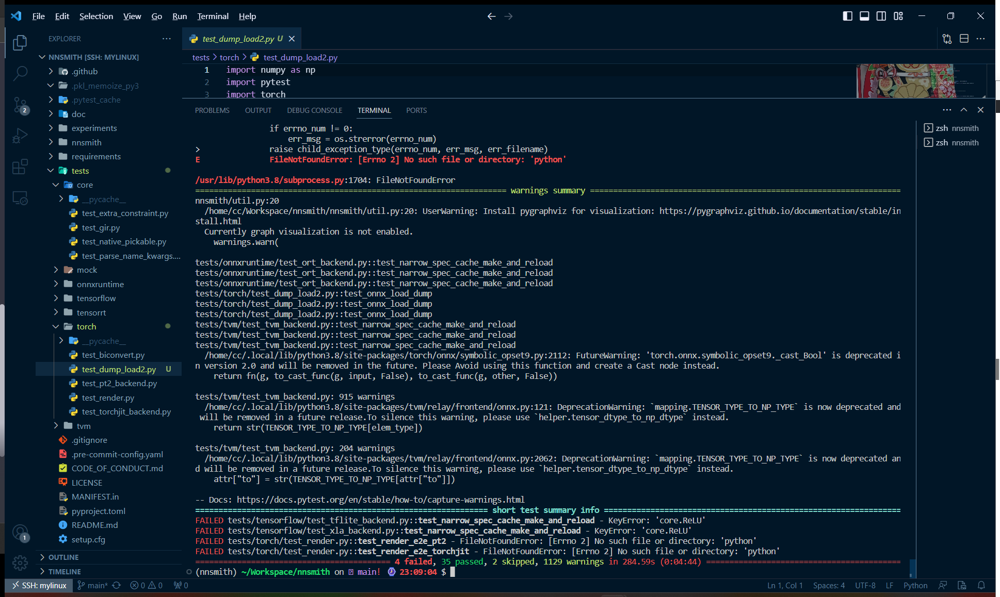
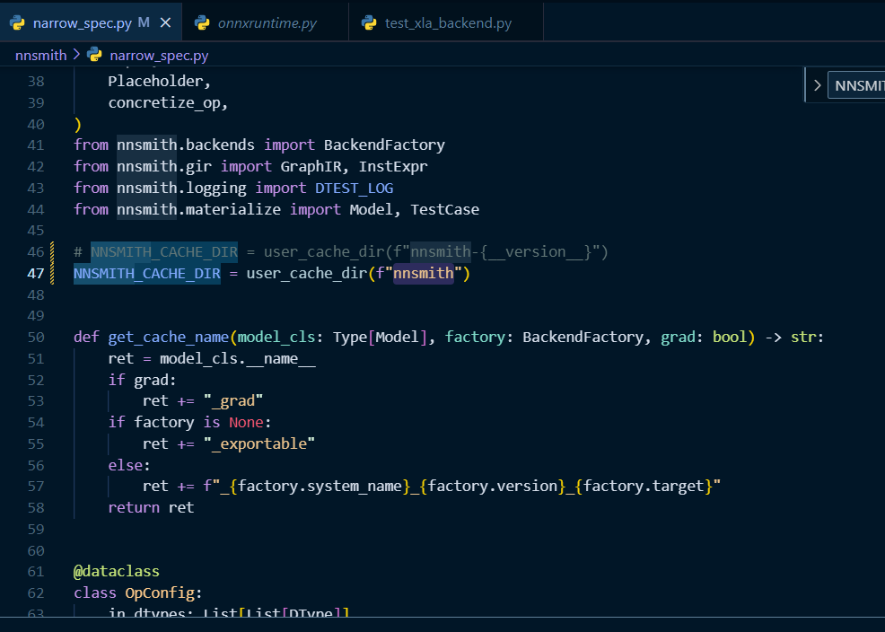
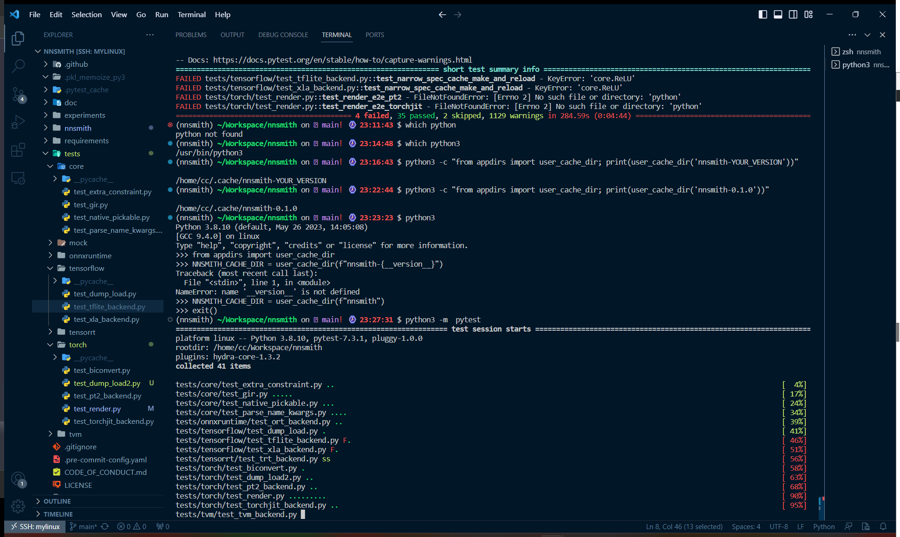
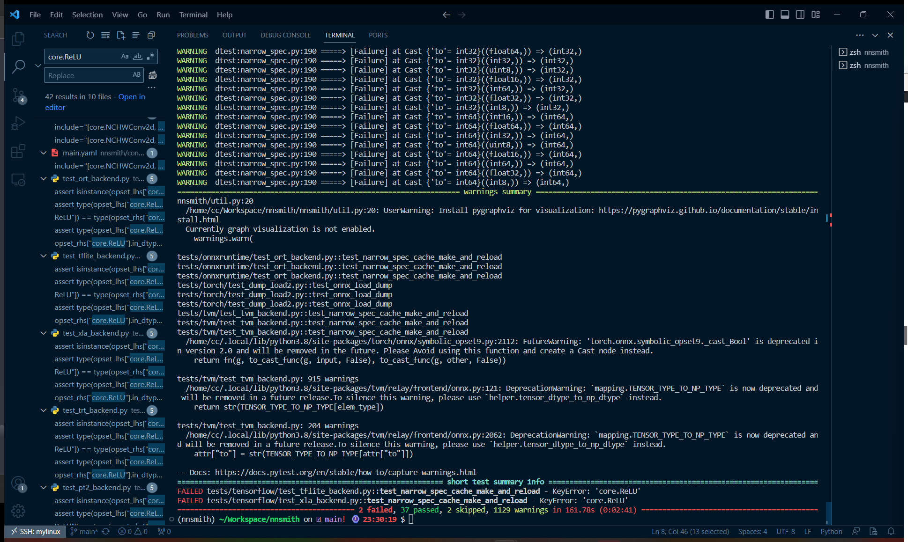

# nnsmith

## 安装

安装环境

- 联想小新
- python3.10.9

```
conda create -n nnsmith
conda activate nnsmith
```


```
python3 -m pip install "nnsmith[torch,onnx,tvm,onnxruntime]" --upgrade
```



```
pip install pytest -i http://pypi.douban.com/simple --trusted-host pypi.douban.com
```

重开终端，运行`pytest`

发现直接在conda环境中pytest失效

需要

```
python3 -m  pytest
```




把缺的module一个个补上

```
pip install tensorflow
pip install GPUtil
```

报错



```
import file mismatch:
imported module 'test_dump_load' has this __file__ attribute:
  /home/cc/Workspace/nnsmith/tests/tensorflow/test_dump_load.py
which is not the same as the test file we want to collect:
  /home/cc/Workspace/nnsmith/tests/torch/test_dump_load.py
HINT: remove __pycache__ / .pyc files and/or use a unique basename for your test file modules
```

以为是缓存机制的问题（下面这条命令应该没用）

```
sudo find . | grep -E "(__pycache__|\.pyc|\.pyo$)" | xargs rm -rf
```

还是报错，感觉应该是存在多个同名文件



将其中一个改名后即可运行



部分报错见文末

关键部分

```
FAILED tests/tensorflow/test_tflite_backend.py::test_narrow_spec_cache_make_and_reload - KeyError: 'core.ReLU'
FAILED tests/tensorflow/test_xla_backend.py::test_narrow_spec_cache_make_and_reload - KeyError: 'core.ReLU'
FAILED tests/torch/test_render.py::test_render_e2e_pt2 - FileNotFoundError: [Errno 2] No such file or directory: 'python'
FAILED tests/torch/test_render.py::test_render_e2e_torchjit - FileNotFoundError: [Errno 2] No such file or directory: 'python'
========================================== 4 failed, 35 passed, 2 skipped, 1129 warnings in 284.59s (0:04:44) ==========================================
```

其中`tests/torch/test_render.py`有两个报错是python找不到，改成python3就行了

查看`tests/tensorflow/test_tflite_backend.py`,

报错函数

```python
def test_narrow_spec_cache_make_and_reload():
    factory = BackendFactory.init("xla", target="cpu", optmax=True)
    ModelType = Model.init("tensorflow")
    opset_lhs = auto_opconfig(ModelType, factory)
    assert opset_lhs, "Should not be empty... Something must go wrong."
    opset_rhs = auto_opconfig(ModelType, factory)
    assert opset_lhs == opset_rhs

    # Assert types
    assert isinstance(opset_lhs["core.ReLU"].in_dtypes[0][0], DType)

    # Assert Dictionary Type Equality
    assert type(opset_lhs) == type(opset_rhs)
    assert type(opset_lhs["core.ReLU"]) == type(opset_rhs["core.ReLU"])
    assert type(opset_lhs["core.ReLU"].in_dtypes[0][0]) == type(
        opset_rhs["core.ReLU"].in_dtypes[0][0]
    )
```

其中调用函数`auto_opconfig`是`nnsmith.narrow_spec`中的

```python
def auto_opconfig(
    model_cls: Model, factory: Optional[BackendFactory], grad: bool = False
) -> Dict[str, OpConfig]:
    cache_path = os.path.join(
        NNSMITH_CACHE_DIR, get_cache_name(model_cls, factory, grad) + ".yaml"
    )

    # mkdir -p NNSMITH_CACHE_DIR
    if not os.path.exists(NNSMITH_CACHE_DIR):
        os.makedirs(NNSMITH_CACHE_DIR)
    if os.path.exists(cache_path):
        DTEST_LOG.info(f"Loading topset from {cache_path}.")
        DTEST_LOG.info(
            "To regenerate the topset, delete the cache file above and restart."
        )
        return load_topset(cache_path)
    else:
        DTEST_LOG.info(f"Inferring topset from scratch and cache it to {cache_path}.")
        opset = infer_topset_from_scratch(model_cls, factory, grad=grad)
        dump_topset(opset, cache_path)
        return opset

```

函数首先检查一个特定的缓存文件是否存在。这个缓存文件的路径由 `NNSMITH_CACHE_DIR` 目录和一个由 `get_cache_name(model_cls, factory, grad)` 函数生成的名字构成，后缀是 ".yaml"。

 `NNSMITH_CACHE_DIR` 是利用 `appdirs` 库中的 `user_cache_dir` 函数设置的

但是我看了下并没有文件夹的路径样式是`nnsmith-{__version__}`，倒是有文件夹叫`nnsmith`（可能带版本号的是需要从realease了下载的）试着这样改了下：



再次pytest



```

```

还是报了这两个错，先不管了，学长要求要运行的是




pytest报错

```


________________________________________________________ test_narrow_spec_cache_make_and_reload ________________________________________________________

    def test_narrow_spec_cache_make_and_reload():
        factory = BackendFactory.init("xla", target="cpu", optmax=True)
        ModelType = Model.init("tensorflow")
        opset_lhs = auto_opconfig(ModelType, factory)
        assert opset_lhs, "Should not be empty... Something must go wrong."
        opset_rhs = auto_opconfig(ModelType, factory)
        assert opset_lhs == opset_rhs
    
        # Assert types
>       assert isinstance(opset_lhs["core.ReLU"].in_dtypes[0][0], DType)
E       KeyError: 'core.ReLU'

tests/tensorflow/test_xla_backend.py:22: KeyError

_________________________________________________________________ test_render_e2e_pt2 __________________________________________________________________

    def test_render_e2e_pt2():
        model = TorchModelCPU()
        model.torch_model = CNN()
    
        model.torch_model.input_like = {"x": AbsTensor([1, 3, 64, 64], DType.float32)}
    
        render = Render()
        render.emit_model(model)
        render.emit_input(model)
        render.emit_backend(PT2(target="cpu", optmax=True))
    
        rendered = render.render()
    
        # pickle is not used (no `ModuleList` in the code)
        # so no need to import pickle
        assert (
            rendered
            == R"""
    import numpy as np
    import torch
    import pickle
    
    # Model definition
    class M(torch.nn.Module):
        def __init__(self):
            super().__init__()
            self.conv = torch.nn.Conv2d(3, 3, kernel_size=(3, 3), stride=(1, 1))
            self.bn = torch.nn.BatchNorm2d(3, eps=1e-05, momentum=0.1, affine=True, track_running_stats=True)
            self.linear = torch.nn.Linear(in_features=62, out_features=3, bias=True)
    
        def forward(self, x):
            conv = self.conv(x);  x = None
            bn = self.bn(conv);  conv = None
            linear = self.linear(bn);  bn = None
            return linear
    
    m = M()
    
    
    # Initialize weight
    # None
    
    # Initialize input
    inp = [np.zeros([1, 3, 64, 64], dtype='float32')]
    
    # Compile the model
    opt = torch.compile(m, fullgraph=True, backend='inductor', mode=None)
    
    # Eager run
    m_out = m(*[torch.from_numpy(v).to('cpu') for v in inp])
    m_out = [v.cpu().detach() for v in m_out] # torch2numpy
    m_out = [v.resolve_conj().numpy() if v.is_conj() else v.numpy() for v in m_out] # torch2numpy
    
    # Compiled run
    opt_out = opt(*[torch.from_numpy(v).to('cpu') for v in inp])
    opt_out = [v.cpu().detach() for v in opt_out] # torch2numpy
    opt_out = [v.resolve_conj().numpy() if v.is_conj() else v.numpy() for v in opt_out] # torch2numpy
    
    # Differential testing
    for i, (l, r) in enumerate(zip(m_out, opt_out)):
        np.testing.assert_allclose(l, r, rtol=1e-2, atol=1e-3, err_msg=f"Result mismatch @ index {i}")
    """
        )
    
        # Run rendered code in a subprocess as a smoke test
>       subprocess.run(
            ["python", "-c", rendered],
            check=True,
            stdout=subprocess.PIPE,
            stderr=subprocess.PIPE,
        )

tests/torch/test_render.py:361: 
_ _ _ _ _ _ _ _ _ _ _ _ _ _ _ _ _ _ _ _ _ _ _ _ _ _ _ _ _ _ _ _ _ _ _ _ _ _ _ _ _ _ _ _ _ _ _ _ _ _ _ _ _ _ _ _ _ _ _ _ _ _ _ _ _ _ _ _ _ _ _ _ _ _ _ _ 
/usr/lib/python3.8/subprocess.py:493: in run
    with Popen(*popenargs, **kwargs) as process:
/usr/lib/python3.8/subprocess.py:858: in __init__
    self._execute_child(args, executable, preexec_fn, close_fds,
_ _ _ _ _ _ _ _ _ _ _ _ _ _ _ _ _ _ _ _ _ _ _ _ _ _ _ _ _ _ _ _ _ _ _ _ _ _ _ _ _ _ _ _ _ _ _ _ _ _ _ _ _ _ _ _ _ _ _ _ _ _ _ _ _ _ _ _ _ _ _ _ _ _ _ _ 

self = <subprocess.Popen object at 0x7f16b2286ee0>
args = ['python', '-c', '\nimport numpy as np\nimport torch\nimport pickle\n\n# Model definition\nclass M(torch.nn.Module):\n...out, opt_out)):\n    np.testing.assert_allclose(l, r, rtol=1e-2, atol=1e-3, err_msg=f"Result mismatch @ index {i}")\n']
executable = b'python', preexec_fn = None, close_fds = True, pass_fds = (), cwd = None, env = None, startupinfo = None, creationflags = 0, shell = False
p2cread = -1, p2cwrite = -1, c2pread = 52, c2pwrite = 54, errread = 56, errwrite = 57, restore_signals = True, start_new_session = False

    def _execute_child(self, args, executable, preexec_fn, close_fds,
                       pass_fds, cwd, env,
                       startupinfo, creationflags, shell,
                       p2cread, p2cwrite,
                       c2pread, c2pwrite,
                       errread, errwrite,
                       restore_signals, start_new_session):
        """Execute program (POSIX version)"""
    
        if isinstance(args, (str, bytes)):
            args = [args]
        elif isinstance(args, os.PathLike):
            if shell:
                raise TypeError('path-like args is not allowed when '
                                'shell is true')
            args = [args]
        else:
            args = list(args)
    
        if shell:
            # On Android the default shell is at '/system/bin/sh'.
            unix_shell = ('/system/bin/sh' if
                      hasattr(sys, 'getandroidapilevel') else '/bin/sh')
            args = [unix_shell, "-c"] + args
            if executable:
                args[0] = executable
    
        if executable is None:
            executable = args[0]
    
        sys.audit("subprocess.Popen", executable, args, cwd, env)
    
        if (_USE_POSIX_SPAWN
                and os.path.dirname(executable)
                and preexec_fn is None
                and not close_fds
                and not pass_fds
                and cwd is None
                and (p2cread == -1 or p2cread > 2)
                and (c2pwrite == -1 or c2pwrite > 2)
                and (errwrite == -1 or errwrite > 2)
                and not start_new_session):
            self._posix_spawn(args, executable, env, restore_signals,
                              p2cread, p2cwrite,
                              c2pread, c2pwrite,
                              errread, errwrite)
            return
    
        orig_executable = executable
    
        # For transferring possible exec failure from child to parent.
        # Data format: "exception name:hex errno:description"
        # Pickle is not used; it is complex and involves memory allocation.
        errpipe_read, errpipe_write = os.pipe()
        # errpipe_write must not be in the standard io 0, 1, or 2 fd range.
        low_fds_to_close = []
        while errpipe_write < 3:
            low_fds_to_close.append(errpipe_write)
            errpipe_write = os.dup(errpipe_write)
        for low_fd in low_fds_to_close:
            os.close(low_fd)
        try:
            try:
                # We must avoid complex work that could involve
                # malloc or free in the child process to avoid
                # potential deadlocks, thus we do all this here.
                # and pass it to fork_exec()
    
                if env is not None:
                    env_list = []
                    for k, v in env.items():
                        k = os.fsencode(k)
                        if b'=' in k:
                            raise ValueError("illegal environment variable name")
                        env_list.append(k + b'=' + os.fsencode(v))
                else:
                    env_list = None  # Use execv instead of execve.
                executable = os.fsencode(executable)
                if os.path.dirname(executable):
                    executable_list = (executable,)
                else:
                    # This matches the behavior of os._execvpe().
                    executable_list = tuple(
                        os.path.join(os.fsencode(dir), executable)
                        for dir in os.get_exec_path(env))
                fds_to_keep = set(pass_fds)
                fds_to_keep.add(errpipe_write)
                self.pid = _posixsubprocess.fork_exec(
                        args, executable_list,
                        close_fds, tuple(sorted(map(int, fds_to_keep))),
                        cwd, env_list,
                        p2cread, p2cwrite, c2pread, c2pwrite,
                        errread, errwrite,
                        errpipe_read, errpipe_write,
                        restore_signals, start_new_session, preexec_fn)
                self._child_created = True
            finally:
                # be sure the FD is closed no matter what
                os.close(errpipe_write)
    
            self._close_pipe_fds(p2cread, p2cwrite,
                                 c2pread, c2pwrite,
                                 errread, errwrite)
    
            # Wait for exec to fail or succeed; possibly raising an
            # exception (limited in size)
            errpipe_data = bytearray()
            while True:
                part = os.read(errpipe_read, 50000)
                errpipe_data += part
                if not part or len(errpipe_data) > 50000:
                    break
        finally:
            # be sure the FD is closed no matter what
            os.close(errpipe_read)
    
        if errpipe_data:
            try:
                pid, sts = os.waitpid(self.pid, 0)
                if pid == self.pid:
                    self._handle_exitstatus(sts)
                else:
                    self.returncode = sys.maxsize
            except ChildProcessError:
                pass
    
            try:
                exception_name, hex_errno, err_msg = (
                        errpipe_data.split(b':', 2))
                # The encoding here should match the encoding
                # written in by the subprocess implementations
                # like _posixsubprocess
                err_msg = err_msg.decode()
            except ValueError:
                exception_name = b'SubprocessError'
                hex_errno = b'0'
                err_msg = 'Bad exception data from child: {!r}'.format(
                              bytes(errpipe_data))
            child_exception_type = getattr(
                    builtins, exception_name.decode('ascii'),
                    SubprocessError)
            if issubclass(child_exception_type, OSError) and hex_errno:
                errno_num = int(hex_errno, 16)
                child_exec_never_called = (err_msg == "noexec")
                if child_exec_never_called:
                    err_msg = ""
                    # The error must be from chdir(cwd).
                    err_filename = cwd
                else:
                    err_filename = orig_executable
                if errno_num != 0:
                    err_msg = os.strerror(errno_num)
>               raise child_exception_type(errno_num, err_msg, err_filename)
E               FileNotFoundError: [Errno 2] No such file or directory: 'python'

/usr/lib/python3.8/subprocess.py:1704: FileNotFoundError
_______________________________________________________________ test_render_e2e_torchjit _______________________________________________________________

    def test_render_e2e_torchjit():
        model = TorchModelCPU()
        model.torch_model = CNN()
    
        model.torch_model.input_like = {"x": AbsTensor([1, 3, 64, 64], DType.float32)}
    
        render = Render()
        render.emit_model(model)
        render.emit_input(model)
        render.emit_backend(TorchJIT(target="cpu", optmax=True))
    
        rendered = render.render()
    
        # pickle is not used (no `ModuleList` in the code)
        # so no need to import pickle
        assert (
            rendered
            == R"""
    import numpy as np
    import torch
    import pickle
    
    # Model definition
    class M(torch.nn.Module):
        def __init__(self):
            super().__init__()
            self.conv = torch.nn.Conv2d(3, 3, kernel_size=(3, 3), stride=(1, 1))
            self.bn = torch.nn.BatchNorm2d(3, eps=1e-05, momentum=0.1, affine=True, track_running_stats=True)
            self.linear = torch.nn.Linear(in_features=62, out_features=3, bias=True)
    
        def forward(self, x):
            conv = self.conv(x);  x = None
            bn = self.bn(conv);  conv = None
            linear = self.linear(bn);  bn = None
            return linear
    
    m = M()
    
    
    # Initialize weight
    # None
    
    # Initialize input
    inp = [np.zeros([1, 3, 64, 64], dtype='float32')]
    
    # Compile the model
    opt = torch.jit.trace(m, [torch.from_numpy(v).to('cpu') for v in inp])
    
    # Eager run
    m_out = m(*[torch.from_numpy(v).to('cpu') for v in inp])
    m_out = [v.cpu().detach() for v in m_out] # torch2numpy
    m_out = [v.resolve_conj().numpy() if v.is_conj() else v.numpy() for v in m_out] # torch2numpy
    
    # Compiled run
    opt_out = opt(*[torch.from_numpy(v).to('cpu') for v in inp])
    opt_out = [v.cpu().detach() for v in opt_out] # torch2numpy
    opt_out = [v.resolve_conj().numpy() if v.is_conj() else v.numpy() for v in opt_out] # torch2numpy
    
    # Differential testing
    for i, (l, r) in enumerate(zip(m_out, opt_out)):
        np.testing.assert_allclose(l, r, rtol=1e-2, atol=1e-3, err_msg=f"Result mismatch @ index {i}")
    """
        )
    
        # Run rendered code in a subprocess as a smoke test
>       subprocess.run(
            ["python", "-c", rendered],
            check=True,
            stdout=subprocess.PIPE,
            stderr=subprocess.PIPE,
        )

tests/torch/test_render.py:434: 
_ _ _ _ _ _ _ _ _ _ _ _ _ _ _ _ _ _ _ _ _ _ _ _ _ _ _ _ _ _ _ _ _ _ _ _ _ _ _ _ _ _ _ _ _ _ _ _ _ _ _ _ _ _ _ _ _ _ _ _ _ _ _ _ _ _ _ _ _ _ _ _ _ _ _ _ 
/usr/lib/python3.8/subprocess.py:493: in run
    with Popen(*popenargs, **kwargs) as process:
/usr/lib/python3.8/subprocess.py:858: in __init__
    self._execute_child(args, executable, preexec_fn, close_fds,
_ _ _ _ _ _ _ _ _ _ _ _ _ _ _ _ _ _ _ _ _ _ _ _ _ _ _ _ _ _ _ _ _ _ _ _ _ _ _ _ _ _ _ _ _ _ _ _ _ _ _ _ _ _ _ _ _ _ _ _ _ _ _ _ _ _ _ _ _ _ _ _ _ _ _ _ 

self = <subprocess.Popen object at 0x7f16b2451460>
args = ['python', '-c', '\nimport numpy as np\nimport torch\nimport pickle\n\n# Model definition\nclass M(torch.nn.Module):\n...out, opt_out)):\n    np.testing.assert_allclose(l, r, rtol=1e-2, atol=1e-3, err_msg=f"Result mismatch @ index {i}")\n']
executable = b'python', preexec_fn = None, close_fds = True, pass_fds = (), cwd = None, env = None, startupinfo = None, creationflags = 0, shell = False
p2cread = -1, p2cwrite = -1, c2pread = 52, c2pwrite = 54, errread = 56, errwrite = 57, restore_signals = True, start_new_session = False

    def _execute_child(self, args, executable, preexec_fn, close_fds,
                       pass_fds, cwd, env,
                       startupinfo, creationflags, shell,
                       p2cread, p2cwrite,
                       c2pread, c2pwrite,
                       errread, errwrite,
                       restore_signals, start_new_session):
        """Execute program (POSIX version)"""
    
        if isinstance(args, (str, bytes)):
            args = [args]
        elif isinstance(args, os.PathLike):
            if shell:
                raise TypeError('path-like args is not allowed when '
                                'shell is true')
            args = [args]
        else:
            args = list(args)
    
        if shell:
            # On Android the default shell is at '/system/bin/sh'.
            unix_shell = ('/system/bin/sh' if
                      hasattr(sys, 'getandroidapilevel') else '/bin/sh')
            args = [unix_shell, "-c"] + args
            if executable:
                args[0] = executable
    
        if executable is None:
            executable = args[0]
    
        sys.audit("subprocess.Popen", executable, args, cwd, env)
    
        if (_USE_POSIX_SPAWN
                and os.path.dirname(executable)
                and preexec_fn is None
                and not close_fds
                and not pass_fds
                and cwd is None
                and (p2cread == -1 or p2cread > 2)
                and (c2pwrite == -1 or c2pwrite > 2)
                and (errwrite == -1 or errwrite > 2)
                and not start_new_session):
            self._posix_spawn(args, executable, env, restore_signals,
                              p2cread, p2cwrite,
                              c2pread, c2pwrite,
                              errread, errwrite)
            return
    
        orig_executable = executable
    
        # For transferring possible exec failure from child to parent.
        # Data format: "exception name:hex errno:description"
        # Pickle is not used; it is complex and involves memory allocation.
        errpipe_read, errpipe_write = os.pipe()
        # errpipe_write must not be in the standard io 0, 1, or 2 fd range.
        low_fds_to_close = []
        while errpipe_write < 3:
            low_fds_to_close.append(errpipe_write)
            errpipe_write = os.dup(errpipe_write)
        for low_fd in low_fds_to_close:
            os.close(low_fd)
        try:
            try:
                # We must avoid complex work that could involve
                # malloc or free in the child process to avoid
                # potential deadlocks, thus we do all this here.
                # and pass it to fork_exec()
    
                if env is not None:
                    env_list = []
                    for k, v in env.items():
                        k = os.fsencode(k)
                        if b'=' in k:
                            raise ValueError("illegal environment variable name")
                        env_list.append(k + b'=' + os.fsencode(v))
                else:
                    env_list = None  # Use execv instead of execve.
                executable = os.fsencode(executable)
                if os.path.dirname(executable):
                    executable_list = (executable,)
                else:
                    # This matches the behavior of os._execvpe().
                    executable_list = tuple(
                        os.path.join(os.fsencode(dir), executable)
                        for dir in os.get_exec_path(env))
                fds_to_keep = set(pass_fds)
                fds_to_keep.add(errpipe_write)
                self.pid = _posixsubprocess.fork_exec(
                        args, executable_list,
                        close_fds, tuple(sorted(map(int, fds_to_keep))),
                        cwd, env_list,
                        p2cread, p2cwrite, c2pread, c2pwrite,
                        errread, errwrite,
                        errpipe_read, errpipe_write,
                        restore_signals, start_new_session, preexec_fn)
                self._child_created = True
            finally:
                # be sure the FD is closed no matter what
                os.close(errpipe_write)
    
            self._close_pipe_fds(p2cread, p2cwrite,
                                 c2pread, c2pwrite,
                                 errread, errwrite)
    
            # Wait for exec to fail or succeed; possibly raising an
            # exception (limited in size)
            errpipe_data = bytearray()
            while True:
                part = os.read(errpipe_read, 50000)
                errpipe_data += part
                if not part or len(errpipe_data) > 50000:
                    break
        finally:
            # be sure the FD is closed no matter what
            os.close(errpipe_read)
    
        if errpipe_data:
            try:
                pid, sts = os.waitpid(self.pid, 0)
                if pid == self.pid:
                    self._handle_exitstatus(sts)
                else:
                    self.returncode = sys.maxsize
            except ChildProcessError:
                pass
    
            try:
                exception_name, hex_errno, err_msg = (
                        errpipe_data.split(b':', 2))
                # The encoding here should match the encoding
                # written in by the subprocess implementations
                # like _posixsubprocess
                err_msg = err_msg.decode()
            except ValueError:
                exception_name = b'SubprocessError'
                hex_errno = b'0'
                err_msg = 'Bad exception data from child: {!r}'.format(
                              bytes(errpipe_data))
            child_exception_type = getattr(
                    builtins, exception_name.decode('ascii'),
                    SubprocessError)
            if issubclass(child_exception_type, OSError) and hex_errno:
                errno_num = int(hex_errno, 16)
                child_exec_never_called = (err_msg == "noexec")
                if child_exec_never_called:
                    err_msg = ""
                    # The error must be from chdir(cwd).
                    err_filename = cwd
                else:
                    err_filename = orig_executable
                if errno_num != 0:
                    err_msg = os.strerror(errno_num)
>               raise child_exception_type(errno_num, err_msg, err_filename)
E               FileNotFoundError: [Errno 2] No such file or directory: 'python'

/usr/lib/python3.8/subprocess.py:1704: FileNotFoundError

=============================================================== short test summary info ================================================================
FAILED tests/tensorflow/test_tflite_backend.py::test_narrow_spec_cache_make_and_reload - KeyError: 'core.ReLU'
FAILED tests/tensorflow/test_xla_backend.py::test_narrow_spec_cache_make_and_reload - KeyError: 'core.ReLU'
FAILED tests/torch/test_render.py::test_render_e2e_pt2 - FileNotFoundError: [Errno 2] No such file or directory: 'python'
FAILED tests/torch/test_render.py::test_render_e2e_torchjit - FileNotFoundError: [Errno 2] No such file or directory: 'python'
========================================== 4 failed, 35 passed, 2 skipped, 1129 warnings in 284.59s (0:04:44) ==========================================

```


