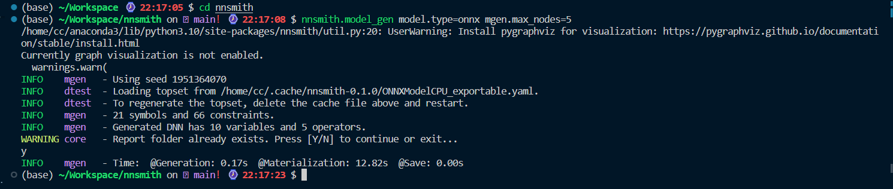

# nnsmith

## 安装

安装环境

- 联想小新
- python3.10.9

```
conda create -n nnsmith
conda activate nnsmith
```


```
python3 -m pip install "nnsmith[torch,onnx,tvm,onnxruntime]" --upgrade
```


```
pip install pytest -i http://pypi.douban.com/simple --trusted-host pypi.douban.com
```

重开终端，运行`pytest`

发现直接在conda环境中pytest失效

需要

```
python3 -m  pytest
```


把缺的module一个个补上

```
pip install tensorflow
pip install GPUtil
```

报错


```
import file mismatch:
imported module 'test_dump_load' has this __file__ attribute:
  /home/cc/Workspace/nnsmith/tests/tensorflow/test_dump_load.py
which is not the same as the test file we want to collect:
  /home/cc/Workspace/nnsmith/tests/torch/test_dump_load.py
HINT: remove __pycache__ / .pyc files and/or use a unique basename for your test file modules
```

以为是缓存机制的问题（下面这条命令应该没用）

```
sudo find . | grep -E "(__pycache__|\.pyc|\.pyo$)" | xargs rm -rf
```

还是报错，感觉应该是存在多个同名文件


将其中一个改名后即可运行


部分报错见文末

关键部分

```
FAILED tests/tensorflow/test_tflite_backend.py::test_narrow_spec_cache_make_and_reload - KeyError: 'core.ReLU'
FAILED tests/tensorflow/test_xla_backend.py::test_narrow_spec_cache_make_and_reload - KeyError: 'core.ReLU'
FAILED tests/torch/test_render.py::test_render_e2e_pt2 - FileNotFoundError: [Errno 2] No such file or directory: 'python'
FAILED tests/torch/test_render.py::test_render_e2e_torchjit - FileNotFoundError: [Errno 2] No such file or directory: 'python'
========================================== 4 failed, 35 passed, 2 skipped, 1129 warnings in 284.59s (0:04:44) ==========================================
```

其中`tests/torch/test_render.py`有两个报错是python找不到，改成python3就行了

查看`tests/tensorflow/test_tflite_backend.py`,

报错函数

```python
def test_narrow_spec_cache_make_and_reload():
    factory = BackendFactory.init("xla", target="cpu", optmax=True)
    ModelType = Model.init("tensorflow")
    opset_lhs = auto_opconfig(ModelType, factory)
    assert opset_lhs, "Should not be empty... Something must go wrong."
    opset_rhs = auto_opconfig(ModelType, factory)
    assert opset_lhs == opset_rhs

    # Assert types
    assert isinstance(opset_lhs["core.ReLU"].in_dtypes[0][0], DType)

    # Assert Dictionary Type Equality
    assert type(opset_lhs) == type(opset_rhs)
    assert type(opset_lhs["core.ReLU"]) == type(opset_rhs["core.ReLU"])
    assert type(opset_lhs["core.ReLU"].in_dtypes[0][0]) == type(
        opset_rhs["core.ReLU"].in_dtypes[0][0]
    )
```

其中调用函数`auto_opconfig`是`nnsmith.narrow_spec`中的

```python
def auto_opconfig(
    model_cls: Model, factory: Optional[BackendFactory], grad: bool = False
) -> Dict[str, OpConfig]:
    cache_path = os.path.join(
        NNSMITH_CACHE_DIR, get_cache_name(model_cls, factory, grad) + ".yaml"
    )

    # mkdir -p NNSMITH_CACHE_DIR
    if not os.path.exists(NNSMITH_CACHE_DIR):
        os.makedirs(NNSMITH_CACHE_DIR)
    if os.path.exists(cache_path):
        DTEST_LOG.info(f"Loading topset from {cache_path}.")
        DTEST_LOG.info(
            "To regenerate the topset, delete the cache file above and restart."
        )
        return load_topset(cache_path)
    else:
        DTEST_LOG.info(f"Inferring topset from scratch and cache it to {cache_path}.")
        opset = infer_topset_from_scratch(model_cls, factory, grad=grad)
        dump_topset(opset, cache_path)
        return opset

```

函数首先检查一个特定的缓存文件是否存在。这个缓存文件的路径由 `NNSMITH_CACHE_DIR` 目录和一个由 `get_cache_name(model_cls, factory, grad)` 函数生成的名字构成，后缀是 ".yaml"。

 `NNSMITH_CACHE_DIR` 是利用 `appdirs` 库中的 `user_cache_dir` 函数设置的

但是我看了下并没有文件夹的路径样式是`nnsmith-{__version__}`，倒是有文件夹叫`nnsmith`（可能带版本号的是需要从realease了下载的）试着这样改了下：


再次pytest


```

```

还是报了这两个错，先不管了，学长要求要运行的是


## 任务要求

```bash
nnsmith.model_gen model.type=onnx mgen.max_nodes=5
```




## 代码分析

### `graph_gen.model_gen`

```python
def model_gen(
    opset: Set[Type[AbsOpBase]],
    method: str = "symbolic",
    max_nodes=5,
    seed=None,
    timeout_ms=10000,
    **kwargs,
):
    assert max_nodes > 0, "max_nodes must >= 1"

    if "symbolic" == method or "symbolic-sinit" == method:
        gen = SymbolicGen(opset, seed, symbolic_init=True, **kwargs)
    elif "symbolic-cinit" == method:
        gen = SymbolicGen(opset, seed, symbolic_init=False, **kwargs)
    elif "concolic" == method:
        gen = ConcolicGen(opset, seed, **kwargs)
    else:
        raise ValueError(f"Unknown method {method}. Try `symbolic` or `concolic`.")

    gen.abstract_gen(max_node_size=max_nodes, max_gen_millisec=timeout_ms)

    return gen

```

参数：

- `opset`：一组用于模型生成的运算
- `method`：接收值为以下几种之一：symbolic、symbolic-sinit、symbolic-cinit、concolic，对应不同模型生成方式（之后单独说明）
- `max_nodes`：规定生成的模型中节点数量上限
- `seed`：随机种子
- `timeout_ms`：超时毫秒数
- `**kwargs`：传进生成模型函数的参数


### 类`graph_gen.SymbolicGen`

方法：
`__init__`：

```python
    def __init__(
        self,
        opset,
        seed=None,
        init_fp=False,
        symbolic_init=True,
        **kwargs,
    ):
        super().__init__(opset, seed, **kwargs)
        if seed is not None:
            set_z3_state(seed)

        self.solver = z3.Solver()
        self.last_solution: Optional[z3.ModelRef] = None

        # Insert the first node.
        if symbolic_init:
            ph = self.make_symbolic_placeholder(
                self.random_rank(), dtype=DType.float32 if init_fp else None
            )
        else:
            ph = self.make_random_concrete_placeholder(
                self.random_rank(), dtype=DType.float32 if init_fp else None
            )

        self.insert_init_ph_node(ph)
        for pred in self.tensor_type_constraints(ph.ttype):
            self.assume(pred)
```
调用超类构造函数。初始化Z3求解器，根据标志创建符号或随机的占位符，调用`insert_init_ph_node`作为第一个节点插入。调用`assume`假定占位符类型的张量约束，

`assume(self, c: z3.BoolRef)`：
接受一个布尔表达式添加到求解器中

`check_sat(self, *assumptions)`：
接受一组假设条件，检查他们是否满足求解器，如果满足会设置`last_solution`这个属性作为求解器模型

`try_forward_insert_at(self, node: AbsOpBase, input_vars: List[str]) -> bool`：

```python
    def try_forward_insert_at(self, node: AbsOpBase, input_vars: List[str]) -> bool:
        # 将输入变量转换为张量
        itensors = [self.ir.vars[vname] for vname in input_vars]
        # 获取该节点的约束条件
        constraints = node.checked_requires(itensors)
        # 日志
        if SMT_LOG.getEffectiveLevel() <= logging.DEBUG:
            SMT_LOG.debug(f"---> Trying to solve: {node} ~ {constraints}")

        # make a copy
        # 对输入张量进行类型转换
        otensors = node.checked_type_transfer(itensors)

        # 对每个输出张量进行检查，如果其大于零则添加到约束条件中
        for aten in otensors:
            for c in aten.gt_zero():
                constraints.append(c)

        # limit output tensor size
        # 限制输出张量的大小
        for aten in otensors:
            constraints.extend(self.tensor_type_constraints(aten))
        # 使用Z3求解器检查这些约束条件是否满足
        check_res = self.check_sat(*constraints)

        if check_res != z3.sat:
            return False
        # 如果结果满足，那么将这些约束条件添加到求解器中
        for c in constraints:
            self.assume(c)

        if MGEN_LOG.getEffectiveLevel() <= logging.DEBUG:
            MGEN_LOG.debug(f">> Forward insert: {node}")
            MGEN_LOG.debug(f"\tinputs:  {itensors}")
            MGEN_LOG.debug(f"\toutputs: {otensors}")
        # 绑定输入和输出张量
        node.bind_input_like(itensors)
        node.bind_output_like(otensors)
        # 在模型中插入这个节点
        self.forward_insert_node(node, input_vars)
        return True
```
尝试以正向方式插入节点，根据节点要求创建约束条件，检查是否可以满足，若满足，假设约束条件并插入节点，返回True。失败则返回False。

`try_occupy_placeholder(self, node: AbsOpBase, phvars: List[str]) -> bool`：

```
    def try_occupy_placeholder(self, node: AbsOpBase, phvars: List[str]) -> bool:
        if MGEN_LOG.getEffectiveLevel() <= logging.DEBUG:
            MGEN_LOG.debug(
                f"---> Trying to occupy placeholder: {phvars} for node {node}"
            )
        # S2 - create X: X can be
        #                   - a new placeholder (fallback)
        #                   - an existing alive shape
        # S2 - 创建X：X可以是一个新的占位符（后备）或者是一个现有的可用shape

        # 将占位符变量名转化为张量
        otensors = [self.ir.vars[name] for name in phvars]

        # S2.2: try to reuse some existing outputs;
        # TODO: allow reuse existing alive shapes
        # n_inps = len(node.inp_ranks)
        # max_try = 2
        # n_reuse = n_inps - 1
        # while n_reuse > 0 and max_try > 0:
        #     # TODO...
        #     max_try -= 1
        #     n_reuse -= 1

        # S2.2: reusing outputs failed. as a fallback, promote all free vars to placeholders.

        # S2.2: 尝试复用一些现有的输出
        # TODO: 允许复用现有的可用形状

        # S2.2: 复用输出失败。作为后备方案，将所有自由变量提升为占位符。
        phs_as_op_inputs: List[Placeholder] = []
        constraints = []
        # 最输入的rank和数据类型进行推断
        for rank, dtype in node.deduct_inp_ranks_and_dtype(otensors):
            # oversample rank 4 tensors as they may be more important
            # 过采样rank 4张量，因为它们可能更重要
            ph = self.make_symbolic_placeholder(
                rank if rank != -1 else self.random_rank(), dtype=dtype
            )
            phs_as_op_inputs.append(ph)
            constraints.extend(ph.ttype.gt_zero())
            constraints.extend(self.tensor_type_constraints(ph.ttype))
        # 获取输入张量的类型
        itensors = [p.ttype for p in phs_as_op_inputs]
        # 将节点要求的约束添加到约束列表中
        constraints.extend(node.checked_requires(itensors))
        # 对输入张量的类型进行推断
        inferred_otensors = node.checked_type_transfer(itensors)
        # 遍历推断出的张量，对其shape进行检查，如果shape等于输出张量的shape并且大于0，就将其添加到约束中
        for i, shape in enumerate(inferred_otensors):
            constraints.extend(shape.eq(otensors[i]))
            constraints.extend(shape.gt_zero())
        # 检查约束是否满足
        check_res = self.check_sat(*constraints)
        # 如果约束不满足，则返回False
        if check_res != z3.sat:
            return False

        if MGEN_LOG.getEffectiveLevel() <= logging.DEBUG:
            MGEN_LOG.debug(f">> Backward insert: {node}")
            MGEN_LOG.debug(f"\tinputs:  {phs_as_op_inputs}")
        # 将满足的约束添加到求解器中
        for c in constraints:
            self.assume(c)

        # succ.
        # 记录输入变量的名称
        input_vars = []
        # 对每个作为操作输入的占位符，在模型中向前插入一个节点，并记录其返回的变量名
        for ph in phs_as_op_inputs:
            inst = self.forward_insert_node(ph, [])
            input_vars.append(inst.retval())
        # 绑定输入和输出张量
        node.bind_input_like(itensors)
        node.bind_output_like(inferred_otensors)
        # 在模型中向后插入节点
        self.backward_insert_node(node, input_vars, phvars)

        return True

```
尝试在模型中用一个占位符插入一个节点。创建一个新的占唯独或者复用现有输出。根据节点的需求生成约束，检查约束是否满足。若满足，则将节点插入模型。