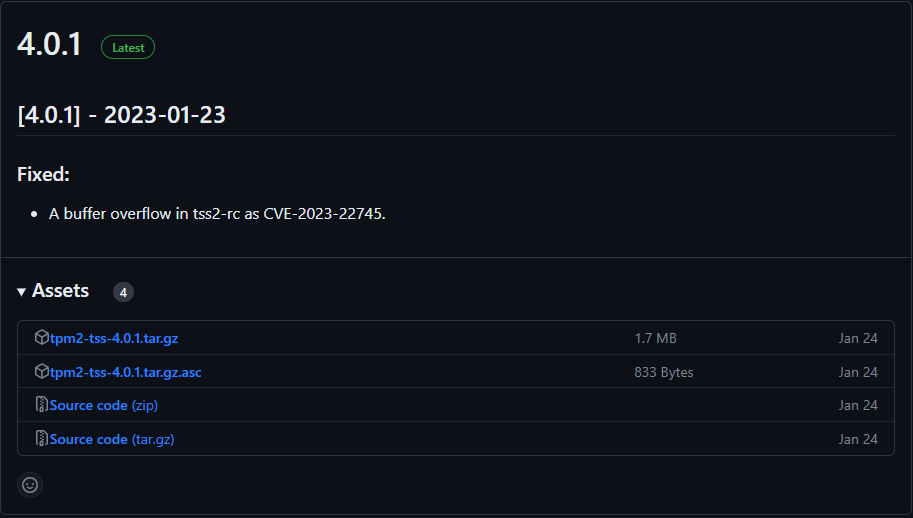
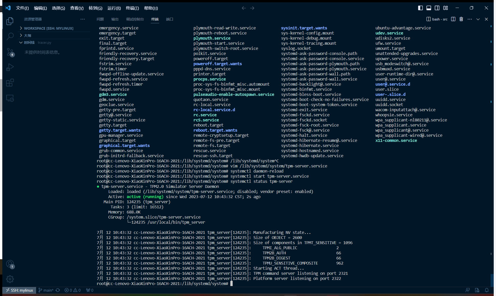
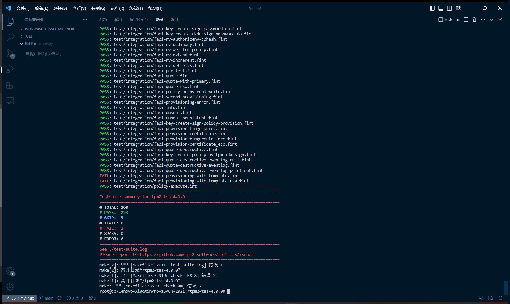
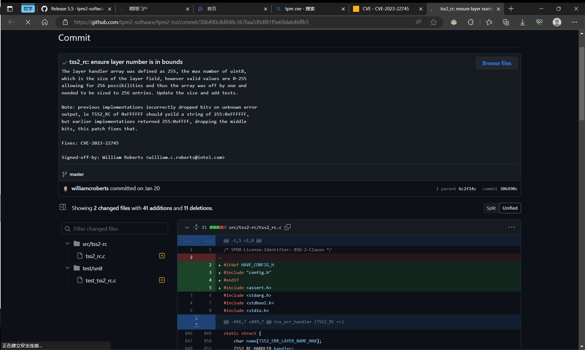

## 漏洞点

4.0.0版本的tss2存在漏洞



## 环境搭建

由于使用docker时总线服务开不出，还是真机上了

### TPM模拟器安装

1. 安装依赖（最好还是分开装，试了下一口气装电脑会直接死机只能重装系统，惨痛的教训）

   ```bash
   sudo apt update
   sudo apt -y install \
     autoconf-archive \
     libcmocka0 \
     libcmocka-dev \
     procps \
     iproute2 \
     build-essential \
     git \
     pkg-config \
     gcc \
     libtool \
     automake \
     libssl-dev \
     uthash-dev \
     autoconf \
     doxygen \
     libjson-c-dev \
     libini-config-dev \
     libcurl4-openssl-dev \
     uuid-dev \
     libltdl-dev \
     libusb-1.0-0-dev \
     libftdi-dev
   ```

2. 下载TPM模拟器程序ibmtpm1682.tar.gz

   ```bash
   wget https://jaist.dl.sourceforge.net/project/ibmswtpm2/ibmtpm1682.tar.gz
   mkdir ibmtpm1682
   cd ibmtpm1682/
   tar zxvf  ../ibmtpm1682.tar.gz
   cd src
   make
   ```

   将tpm服务器添加到Linux系统执行目录下：

   ```bash
   sudo cp tpm_server /usr/local/bin/
   ```

   切换root配置TPM服务(创建tpm.server.service文件和配置服务)：

   ```bash
   vim /lib/systemd/system/tpm-server.service
   ```

   文件内容

   ```
   [Unit]
   Description=TPM2.0 Simulator Server Daemon
   Before=tpm2-abrmd.service
   [Service]
   ExecStart=/usr/local/bin/tpm_server
   Restart=always
   Environment=PATH=/usr/bin:/usr/local/bin
   [Install]
   WantedBy=multi-user.target
   ```

   

   测试

   ```bash
   systemctl daemon-reload
   systemctl enable tpm-server # 该行不确定需不需要
   systemctl start tpm-server.service
   systemctl status tpm-server
   ```

   

   **下面报错的部分真机时没遇到问题**
   
   第一行报错
   
```
   [AFL++ f80ba12ce867] / # systemctl daemon-reload
ERROR:systemctl: dbus.service: Executable path is not absolute, ignoring: @/usr/bin/dbus-daemon @dbus-daemon --system --address=systemd: --nofork --nopidfile --systemd-activation --syslog-only
```

   修复

   

   

   服务运行成功

   

   

### intel tpm软件包安装

一共有三个，tpm2-tss、tpm2-abrmd、tpm2-tools，需按该顺序安装

1. 添加tss用户

   ```bash
   useradd --system --user-group tss
   ```

2. 下载tss

   ```bash
   cd /
   wget https://github.com/tpm2-software/tpm2-tss/releases/download/4.0.0/tpm2-tss-4.0.0.tar.gz
   tar -zxf ./tpm2-tss-4.0.0.tar.gz
   cd tpm2-tss-4.0.0/
   ```

   

   ```bash
   ./configure --enable-unit --enable-integration
   make -j$(nproc) check
   ```

   缺哪个装哪个，总结下来

   ```
   apt install libjson-c-dev iproute2
   ```

   

   make check又出错

   ```
   PASS: test/integration/fapi-quote-destructive-eventlog.fint
   PASS: test/integration/fapi-quote-destructive-eventlog-pc-client.fint
   FAIL: test/integration/fapi-provisioning-with-template.fint
   FAIL: test/integration/fapi-provisioning-with-template-rsa.fint
   PASS: test/integration/policy-execute.int
   ============================================================================
   Testsuite summary for tpm2-tss 4.0.0
   ============================================================================
   # TOTAL: 260
   # PASS:  253
   # SKIP:  5
   # XFAIL: 0
   # FAIL:  2
   # XPASS: 0
   # ERROR: 0
   ============================================================================
   See ./test-suite.log
   Please report to https://github.com/tpm2-software/tpm2-tss/issues
   ============================================================================
   make[2]: *** [Makefile:32811：test-suite.log] 错误 1
   make[2]: 离开目录“/tpm2-tss-4.0.0”
   make[1]: *** [Makefile:32919：check-TESTS] 错误 2
   make[1]: 离开目录“/tpm2-tss-4.0.0”
   make: *** [Makefile:33539：check-am] 错误 2
   ```

   

   

   

3. 下载tpm2-abrmd

   ```bash
   cd /
   wget https://github.com/tpm2-software/tpm2-abrmd/releases/download/3.0.0/tpm2-abrmd-3.0.0.tar.gz
   tar -zxf tpm2-abrmd-3.0.0.tar.gz
   cd tpm2-abrmd-3.0.0/
   ldconfig
   ./configure --with-dbuspolicydir=/etc/dbus-1/system.d --with-systemdsystemunitdir=/lib/systemd/system
   
   ```

   其中加–with-dbuspolicydir=/etc/dbus-1/system.d选项，这样可以将tpm2-abrmd声明到系统总线上，允许tss账户声明该策略。–with-systemdsystemunitdir=/lib/systemd/system是为了将tpm2-abrmd添加进系统引导

   缺啥补啥

   ```bash
   apt install libtss2-dev
   ```

   

   添加tpm2-abrmd进入系统服务

   ```bash
   cp /home/cc/tpm2-abrmd-3.0.0/dist/com.intel.tss2.Tabrmd.service /usr/share/dbus-1/system-services/ 
   pkill -HUP dbus-daemon # 重启
   ```

   修改tpm2-abrmd.service服务配置

   ```bash
   vim /lib/systemd/system/tpm2-abrmd.service
   ```

   添加

   ```bash
   --tcti="libtss2-tcti-mssim.so.0:host=127.0.0.1,port=2321"
   ```

   

   报错

   ```bash
   sudo systemctl enable tpm2-abrmd.service
   sudo systemctl start tpm2-abrmd.service 
   ```

   这是因为 AFL++ 提供的容器环境可能不支持dbus通信

   看了下发现是dbus等服务出问题了

   运行systemctl daemon-reload报错如下

   ```
   [AFL++ f80ba12ce867] /lib/systemd/system # systemctl daemon-reload
   ERROR:systemctl: dbus.service: Executable path is not absolute, ignoring: @/usr/bin/dbus-daemon @dbus-daemon --system --address=systemd: --nofork --nopidfile --systemd-activation --syslog-only
   ERROR:systemctl: systemd-udev-settle.service: Executable path is not absolute, ignoring: udevadm settle
   ERROR:systemctl: systemd-udev-trigger.service: Executable path is not absolute, ignoring: -udevadm trigger --type=subsystems --action=add
   ERROR:systemctl: systemd-udev-trigger.service: Executable path is not absolute, ignoring: -udevadm trigger --type=devices --action=add
   ERROR:systemctl: systemd-udevd.service: Executable path is not absolute, ignoring: udevadm control --reload --timeout 0
   ERROR:systemctl: udev.service: Executable path is not absolute, ignoring: udevadm control --reload --timeout 0
   ```

   cd到/lib/systemd/system目录将以下文件的ExecStart和ExecReload修改为绝对路径

   dbus.service

   ```bash
   ExecStart=/usr/bin/dbus-daemon --system --address=systemd: --nofork --nopidfile --systemd-activation --syslog-only
   ```

   systemd-udev-settle.service

   ```bash
   ExecStart=/usr/bin/udevadm settle
   ```

   systemd-udev-trigger.service

   ```bash
   ExecStart=-/usr/bin/udevadm trigger --type=subsystems --action=add
   ExecStart=-/usr/bin/udevadm trigger --type=devices --action=add
   ```

   systemd-udevd.service

   ```bash
   ExecStart=/lib/systemd/systemd-udevd
   ExecReload=/usr/bin/udevadm control --reload --timeout 0
   ```

   

   

   ## 漏洞修复

   https://github.com/tpm2-software/tpm2-tss/commit/306490c8d848c367faa2d9df81f5e69dab46ffb5

   
   
   
   
   ### 代码更改分析
   
   1. 在 `tss2_rc.c` 中的 `layer_handler` 数组中，原本定义的数组大小为 `TPM2_ERROR_TSS2_RC_LAYER_COUNT`，在修改后的代码中，该数组的大小变更为 `TPM2_ERROR_TSS2_RC_LAYER_COUNT + 1`。解决缓冲区溢出的问题，即尝试为更高编号的层添加处理程序或解码具有此类层号的响应代码会在缓冲区末尾读取/写入的问题。
   2. 函数 `unknown_layer_handler` 的参数从 `tpm2_error_get(rc)` 变为了 `rc`。确保未知的错误层能够被正确地处理。
   3. `Tss2_RC_Decode` 函数的修改主要是在处理错误层的逻辑上做了一些调整，比如，如果 handler 存在，则像以前一样处理错误；如果 handler 不存在，则直接调用 `unknown_layer_handler` 函数，并且传递的参数做了右移8位的处理。
   
   在 `test_tss2_rc.c` 测试代码中，添加了两个新的测试：`test_all_FFs` 和 `test_all_FFs_set_handler`，这两个测试应该是为了验证处理 0xFFFFFFFF 这种情况的逻辑是否正确。
   
   综合以上改动，这次代码的修改主要是针对处理错误层的逻辑做了一些优化和修复，包括增大了 layer_handler 数组的大小，优化了处理未知错误层的逻辑，以及增加了一些新的测试用例来验证改动的正确性。

