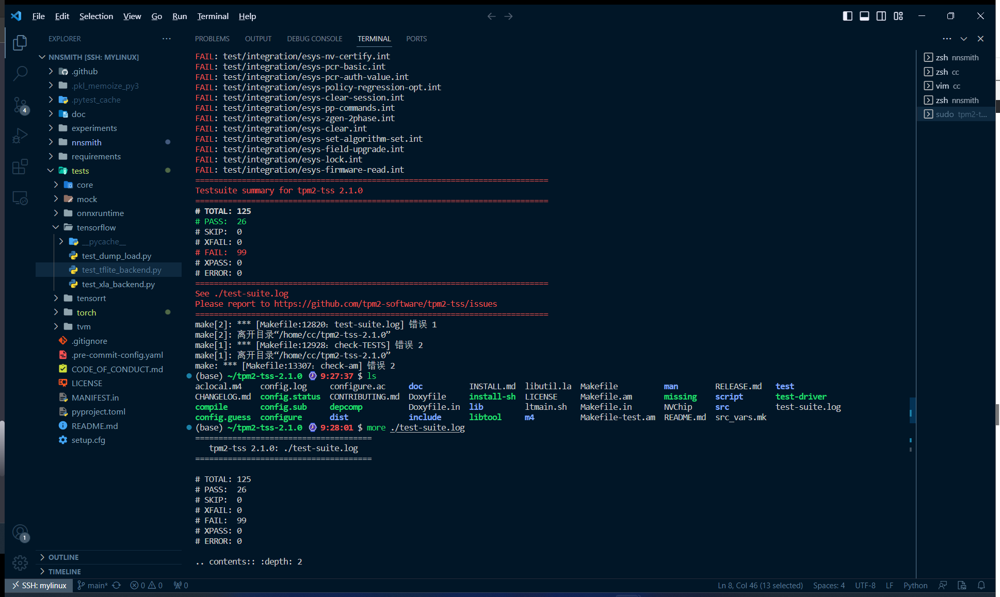
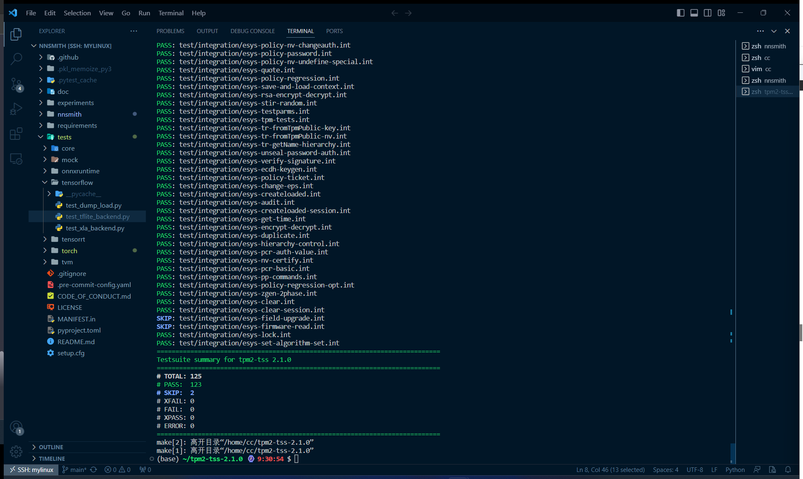

## 安装tpm模拟器


```
sudo apt install lcov pandoc autoconf-archive liburiparser-dev libdbus-1-dev libglib2.0-dev dbus-x11 libssl-dev \
autoconf automake libtool pkg-config gcc  libcurl4-gnutls-dev libgcrypt20-dev libcmocka-dev uthash-dev

```


```
cd ~
wget https://jaist.dl.sourceforge.net/project/ibmswtpm2/ibmtpm1332.tar.gz
mkdir ibmtpm1332
cd ibmtpm1332/
tar zxvf  ../ibmtpm1332.tar.gz
cd src/
sudo make
sudo cp tpm_server /usr/local/bin/
sudo vim /lib/systemd/system/tpm-server.service
```

```
[Unit]
Description=TPM2.0 Simulator Server Daemon
Before=tpm2-abrmd.service
[Service]
ExecStart=/usr/local/bin/tpm_server
Restart=always
Environment=PATH=/usr/bin:/usr/local/bin
[Install]
WantedBy=multi-user.target
```


### intel tpm软件包安装配置

### Tpm2-tss

```
cd ~
sudo useradd --system --user-group tss
wget https://github.com/tpm2-software/tpm2-tss/releases/download/2.1.0/tpm2-tss-2.1.0.tar.gz
tar -zxf ./tpm2-tss-2.1.0.tar.gz
cd tpm2-tss-2.1.0/
./configure --enable-unit --enable-integration
make check -j4
```



报了99个错，问题居然是`netstat`命令找不到

```
sudo apt-get install net-tools
```

重新make check通过



```
sudo ldconfig
make install
```


### Tpm2-abrmd

需要

```
sudo apt-get install libglib2.0-dev
```


```
cd ~
wget https://github.com/tpm2-software/tpm2-abrmd/releases/download/2.0.2/tpm2-abrmd-2.0.2.tar.gz
tar zxvf tpm2-abrmd-2.0.2.tar.gz
cd tpm2-abrmd-2.0.2/
sudo ldconfig
./configure --with-dbuspolicydir=/etc/dbus-1/system.d --with-systemdsystemunitdir=/lib/systemd/system
sudo make install
sudo cp /usr/local/share/dbus-1/system-services/com.intel.tss2.Tabrmd.service /usr/share/dbus-1/system-services/
sudo pkill -HUP dbus-daemon

sudo vim /lib/systemd/system/tpm2-abrmd.service
```

在ExecStart后添加

```
--tcti="libtss2-tcti-mssim.so.0:host=127.0.0.1,port=2321"
```

```
systemctl daemon-reload
systemctl start tpm2-abrmd.service
service tpm2-abrmd status
```

### Tpm2-tools