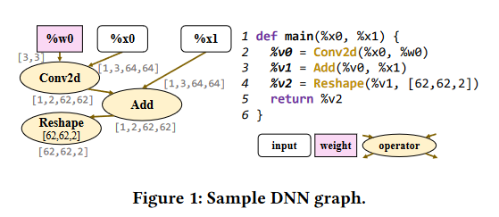
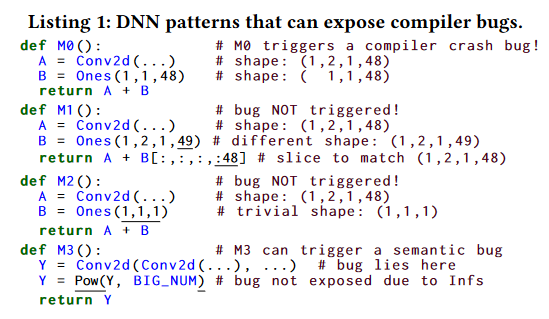
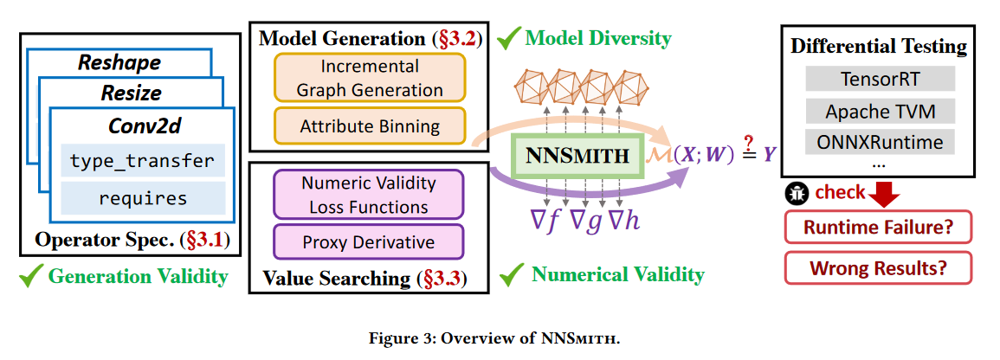
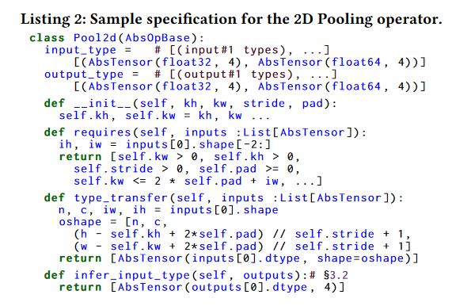
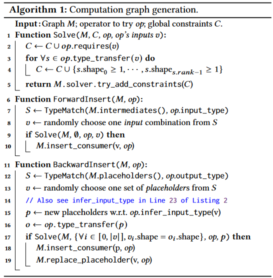
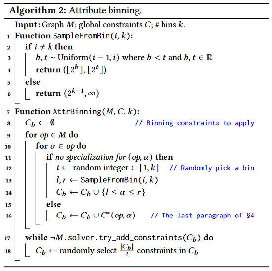

## 概述

文章提出了一种新的模糊测试的方法，用于发现深度学习编译器中的错误。

方法包括：

- 生成多样化但有效的DNN测试模型
- 执行基于梯度的搜索以查找模型输入，以避免模型执行过程中出现异常浮点值
- 使用差异测试识别错误

## 背景

### DNN计算图

DL（大数据模型）框架将模型计算表示为张量运算符的有向图，其重点便是DNN（深度神经网络）推断。

DNN图表捕获了前向的神经网络计算过程，根据模型权重和输入生成预测标签或输出。

DNN图例：



上游运算符的输入输出间有时候有联系，比如图例中`Reshape`的传参有`%v1`和`[62,62,2]`，则只有上游输出`%v1`有62\*62\*2个元素时`Reshape`才有效

### DL编译器（深度学习编译器）

最先进的DL编译器可以做到将用户给定的模型表示为DNN计算图，转化为可以执行的实现。

工作流程：

1. 将输入的计算图转为自己的内部格式，引入模型导出为标准格式如ONNX模型，将标准格式的模型作为输入，将其转换为特定于编译器的中间表示IR
2. 调用各种转换过程，将IR重写为更高效的版本

编译器错误可能发生在转换（conversion）和转换（transformation）阶段

### 查找DL编译器bug的挑战

可能有前景的方法：查分测试、模糊测试

做法：

- 合成最忌模型进行编译，然后用随机输入运行编译后的模型，再将生成结果与参考进行对比

示例：由于使用了非保型运算符Conv2d，M0会触发编译器崩溃错误



1. **生成不同模式的图：**

   查找DL编译器的bug需要生成包含各种运算符和连接的输入图。先前使用单算子的测试限制太大；使用多算子的容易受限于类型运算符间的连接，限制图多样性。

   如图：M1使用切片来修复生成图中形状不匹配的张量，后果：导致生成图形中包含许多切片/填充节点，在这里M1的切片隐藏了在M0中发现的布局错误

2. **探索运算符和边的多样化属性**

   生成图形时容易忽视运算符/属性空间需求而依赖于特征值

   如图：M2使用平凡属性（全为1）来初始化运算符Ones，使M0发现的错误不会被M2发现

3. **运行编译后的模型以生成数值有效的输出**

## NNSMITH设计



分为几步：以编译器类型检查作为输入、生成有效的随机模型、运行模型时梯度引导搜索寻找良性权重/输入（确保之后不会产生FP异常值）、与参考实现进行比较，识别错误

### DNN运算符建模

NNSmith会连接不同的运算符生成随机的DNN模型，模型以计算图的形式表示。

目标：生成通过类型检查的有效图形

实施方法：需要用户提供运算符规范，明确给出所有运算符的编译器要求和输出保证。

实例规范：



名称：运算符的名称。 

输入：输入类型，使用抽象张量指定。 

输出：输出类型，使用抽象张量指定。 

约束：输入张量形状和属性的约束。 

转换：定义运算符行为的转换规则。

```
Name: Pool2d
Input: (Float32, 4, [Any, Any, Any, Any])
Output: (Float32, 4, [Any, Any, Any, Any])
Constraints:
- Input shape: The input shape must be rank-4.
Transfer:
- Pooling operation: The operator applies a pooling operation to the input tensor.

```


### 模型生成

NNSmith生成拓扑多样且操作符使用多样属性的模型。

**生成计算图的方法：**

- 从单个占位符节点的图形开始，通过以下两种方法扩展：
  1. 添加新节点，输入边与现有节点输出相连（前向插入）
  2. 用一个操作符节点替换现有占位符节点，输入边与一个或多个占位符节点相连（后向插入）

- 添加的节点是从提供给它的符号操作符规范（op）的集合中随机选择的

- 生成算法：

  

- 随机插入步骤详解：

  - 类型匹配：

    类型匹配启发式方法过滤，用SMT求解器检查约束性，过滤不符合的输出边

  - 约束求解：

    进一步过滤，使用NNSmith生成的约束和SMT求解器进行检查。并缓存约束，减少开销

  - 节点插入：

    前插或后插

**属性分箱：**

这部分还没细看



### 

